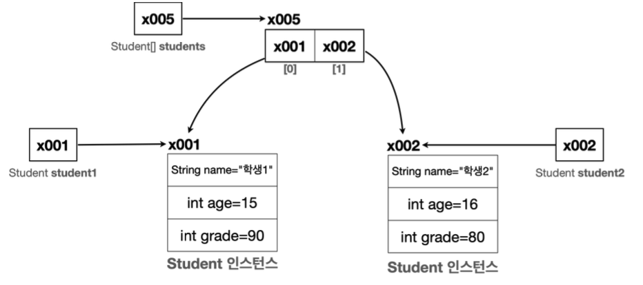

# 1. 클래스와 데이터

## 클래스가 필요한 이유
자바 세상은 클래스와 객체로 이루어져 있다. 그만큼 클래스와 객체라는 개념은 중요하다.

### 문제: 학생 정보 출력 프로그램
**변수 사용**
```java
package class1;

public class ClassStart1 {
    public static void main(String[] args) {
        String student1Name = "학생1"; 
        int student1Age = 15;
        int student1Grade = 90;
        
        String student2Name = "학생2"; 
        int student2Age = 16;
        int student2Grade = 80;
        
        System.out.println("이름:" + student1Name + " 나이:" + student1Age + " 성 적:" + student1Grade);
        System.out.println("이름:" + student2Name + " 나이:" + student2Age + " 성 적:" + student2Grade);
    }
}
```
학생 2명 각기 다른 변수. 확장이 될 수록 불편 할것이다.
개선해보자.

**배열 사용**
```java
package class1;

public class ClassStart2 {
    public static void main(String[] args) {
        String[] studentNames = {"학생1", "학생2"}; 
        int[] studentAges = {15, 16};
        int[] studentGrades = {90, 80};

        for (int i = 0; i < studentNames.length; i++) {
            System.out.println("이름:" + studentNames[i] + " 나이:" + studentAges[i] + " 성적:" + studentGrades[i]);
        }
    }
}
```
배열을 사용한 덕분에 학생이 추가되어도 배열에 학생의 데이터만 추가하면 된다. 이제 변수를 더 추가하지 않아도 되고, 출력 부분의 코드도 그대로 유지할 수 있다.

**배열 사용의 한계**
하지만 특정 학생의 데이터를 변경할 시 순서를 정확하게 맞추어야 하고 실수할 가능성이 높다. 
컴퓨터가 볼 때는 아무 문제가 없지만, 사람이 관리하기에는 좋은 코드가 아니다.

**정리**
지금처럼 이름, 나이, 성적을 각각 따로 나누어서 관리하는 것은 사람이 관리하기 좋은 방식이 아니다.
사람이 관리하기 좋은 방식은 학생이라는 개념을 하나로 묶는 것이다. 그리고 각각의 학생 별로 본인의 이름, 나이, 성적을 관리하는 것이다.

## 클래스 도입

**Student 클래스**
```java
package class1;

public class Student {
    String name;
    int age;
    int grade; 
}
```
클래스를 사용해서 학생이라는 개념을 만들고, 각각의 학생 별로 본인의 이름, 나이, 성적을 관리하는 것이다.

이렇게 **클래스에 정의한 변수들을 멤버 변수, 또는 필드**라 한다.
- **멤버 변수(Member Variable)**: 이 변수들은 특정 클래스에 소속된 멤버이기 때문에 이렇게 부른다.
- **필드(Field)**: 데이터 항목을 가리키는 전통적인 용어. 데이터베이스, 엑셀 등에서 데이터 각각의 항목을 필드라 한다.
- 자바에서 멤버 변수, 필드는 같은 뜻. 클래스에 소속된 변수를 뜻한다.

**클래스는 관례상 대문자로 시작하고 낙타 표기법을 사용한다.**

**클래스와 사용자 정의 타입**
- 클래스를 사용하면 `int`, `String`과 같은 타입을 직접 만들 수 있다.
- 사용자가 직접 정의하는 사용자 정의 타입을 만들려면 설계도가 필요하다. 이 **설계도가 바로 클래스**
- 설계도인 클래스를 사용해서 **실제 메모리에 만들어진 실체를 객체 또는 인스턴스**라 한다.
- 클래스를 통해서 사용자가 원하는 종류의 데이터 타입을 마음껏 정의할 수 있다.

**용어: 클래스, 객체, 인스턴스**

클래스는 설계도, 이 설계도를 기반으로 실제 메모리에 만들어진 실체를 객체 또는 인스턴스라 한다. 둘다 같은 의미로 사용

순서는 다음과 같다. 
1. 변수선언 -> 2. 객체 생성 -> 3. 참조값 보관


**참조값을 변수에 보관해야 하는 이유**

객체를 생성하는 `new Student()`코드는 아무런 이름이 없다. 단순히 `Student`클래스를 기반으로 메모리에 실제 객체를 만드는 것. 따라서 객체에 접근할 수 있는 방법이 필요하다. 이런 이유로 객체를 생성할 때 반한되는 참조값을 어딘가에 보관해두어야 한다. 


## 객체 사용
클래스를 통해 생성한 객체를 사용하려면 먼저 메모리에 존재하는 객체에 접근해야 한다. 객체에 접근하려면 `.`(점, dot)을 사용


## 클래스, 객체, 인스턴스 정리
### 클래스 - Class
클래스는 객체를 생성하기 위한 '틀'또는 '설계도'이다. 클래스는 객체가 가져야 할 속성(변수)과 기능(메서드)를 정의한다.

### 객체 - Object
객체는 클래스에서 정의한 속성과 기능을 가진 실체이다. 객체는 서로 독립적인 상태를 가진다.

### 인스턴스 - Instance
인스턴스는 특정 클래스로부터 생성된 객체를 의미한다. 그래서 객체와 인스턴스라는 용어는 자주 혼용된다. 인스턴스는 주로 객체가 어떤 클래스에 속해 있는지 강조할 때 사용한다.

### 객체 vs 인스턴스
둘다 클래스에서 나온 실체라는 의미에서 비슷하게 사용되지만, 용어상 인스턴스는 객체보다 좀 더 관계에 초점을 맞춘 단어이다. 보통은 `student1`은 `Student`의 객체이다. 라고 말하는 대신 `student1`은 `Student`의 인스턴스이다. 
우리가 인스턴스라고 부르는 순간은 특정 클래스로부터 그 객체가 생성되었음을 강조하고 싶을 때이다. 
예를 들어 `student1`은 객체이지만, 이 객체가 `Student`클래스로부터 생성되다는 점을 명확히 하기 위해 `student1`은 `Student`의 인스턴스라고 부른다.

**하지만 둘다 클래스에서 나온 실체라는 핵심 의미는 같기 때문에 보통 둘을 구분하지 않고 사용한다.**

## 배열 도입 - 시작

잊지 말아야 할 것: 자바에서 대입은 항상 변수에 들어 있는 값을 복사한다. 

**배열에 참조값을 대입한 이후 배열 그림**

자바에서 대입은 항상 변수에 들어 있는 값을 복사해서 전달한다. 
```java
students[0] = student1;
students[1] = student2;

//자바에서 대입은 항상 변수에 들어 있는 값을 복사한다.
students[0] = x001;
students[1] = x002;
```
**주의!**
변수에는 인스턴스 자체가 들어있는 것이 아니다! 인스턴스의 위치를 가리키는 참조값이 들어있을 뿐이다! **따라서 대입(=)시에 인스턴스가 복사되는 것이 아니라 참조값만 복사된다.**

**향상된 for문(Enganced For Loop)**
IntelliJ에서 iter 단축어를 쓰면 빠르게 사용이 가능하다. 왠만하면 이 기능을 쓰자.

