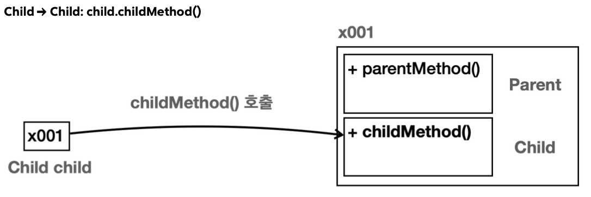
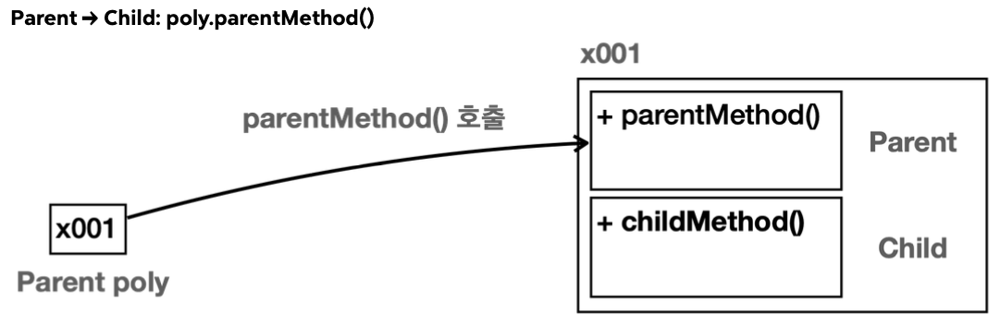

# 다형성1

## 다형성 시작
객체지향 프로그래밍의 대표적인 특징으로는 캡슐화, 상속, 다형성이 있다. 그 중에서 다형성은 객체지향 프로그래밍의 꽃이라 불린다.
앞서 학습한 캡슐화나 상속은 직관적으로 이해하기 쉽다. 반면에 다형성은 제대로 이해하기도 어렵고, 잘 활용하기는 더 어렵다. 하지만 좋은 개발자가 되기 위해서는 다형성에 대한 이해가 필수다.

**다형성(Polymorphism)** 은 이름 그대로 "다양한 형태", "여러 형태"를 뜻한다.
프로그래밍에서 다형성은 한 객체가 여러 타입의 객체로 취급될 수 있는 능력을 뜻한다. 보통 하나의 객체는 하나의 타입으로 고정되어 있다. 그런데 다형성을 사용하면 하나의 객체가 다른 타입으로 사용될 수 있다는 뜻이다. 

다형성을 이해하기 위해서는 크게 2가지 핵심 이론을 알아야 한다.
- 다형적 참조
- 메서드 오버라이딩

### 다형적 참조
부모는 자식을 품을 수 있다.
자식은 부모를 담을 수 없다.

부모 클래스인 `Parent`, 그를 상속받는 `Child` 클래스가 있다.

각자의 타입의 변수가 각자의 인스턴스 참조 하는것은 다 아는 사실이다.

근데 자식 타입의 변수가 자식 인스턴스 참조 하는 경우는 조금 달랐다.

메모리상 이런 그림이 나온다. 하나하나씩 뜯어보면 
- `Child child = new Child()`
- `Child`인스턴스를 만들었다. 이 경우 자식 타입인 `Child`를 생성했기 때문에 메모리 상에 `Child`와 `Parent`가 모두 생성된다.
- 생성된 참조값을 `Child`타입의 변수인 `child`에 담아둔다.
- `child.childMethod()`를 호출하면 인스턴스의 `Child`클래스에 있는 `childMetdho()`가 호출된다.

그리고 핵심 내용이 등장한다.

**다형적 참조: 부모 타입의 변수가 자식 인스턴스 참조**

- 부모 타입의 변수가 자식 인스턴스를 참조한다.
- `Parent poly = new Child()`
- `Child`인스턴스를 만들었다. 이 경우 자식 타입인 `Child`를 생성했기 때문에 메모리 상에 `Child`와 `Parent`가 모두 생성된다.
- 생성된 참조값을 `Parent`타입의 변수인 `poly`에 담아둔다. 

**부모는 자식을 담을 수 있다.**
- 부모 타입은 자식 타입을 담을 수 있다.
- `Parent poly`는 부모 타입이다. `new Child()`를 통해 생성된 결과는 `Child`타입이다. 자바에서 부모 타입은 자식 타입을 담을 수 있다!
	- `Parent poly = new Child()`: 성공
- 반대로 자식 타입은 부모 타입을 담을 수 없다.
	- `Child child1 = new Parent()`: 컴파일 오류 발생

**다형적 참조**
지금까지 학습한 내용을 떠올려보면 항상 같은 타입에 참조를 대입했다. 그래서 보통 한 가지 형태만 참조할 수 있다.
그런데 `Parent`타입의 변수는 자신인 `Parent`는 물론이고, 자식 타입까지 참조할 수 있다. 만약 손자가 있다면 손자까지 가능하다.
자바에서 부모 타입은 자신은 물론이고, 자신을 기준으로 모든 자식 타입을 참조할 수 있다. 이것이 바로 다양한 형태를 참조할 수 있다고 해서 다형적 참조라 한다.

