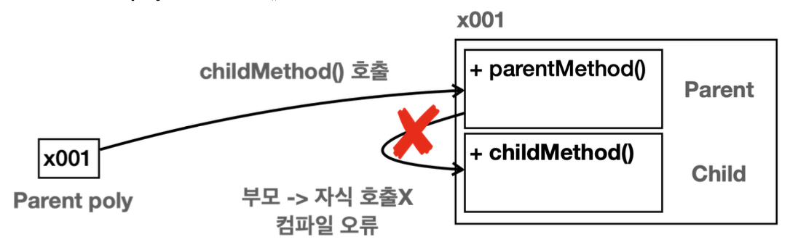
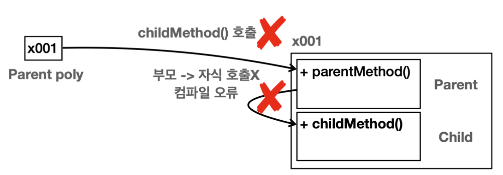
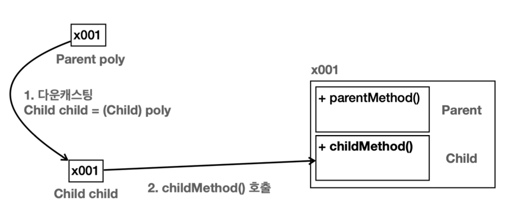
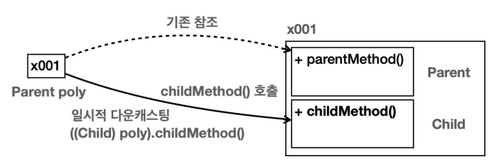
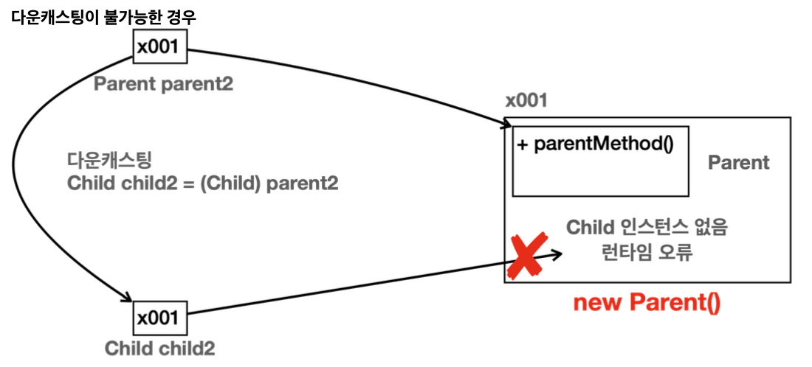
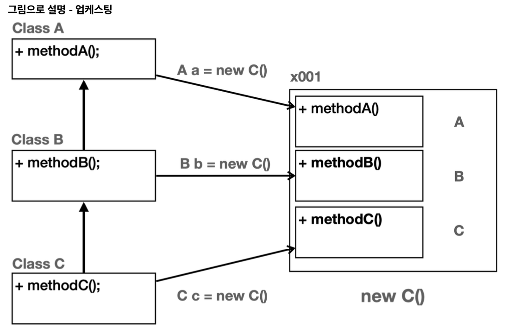
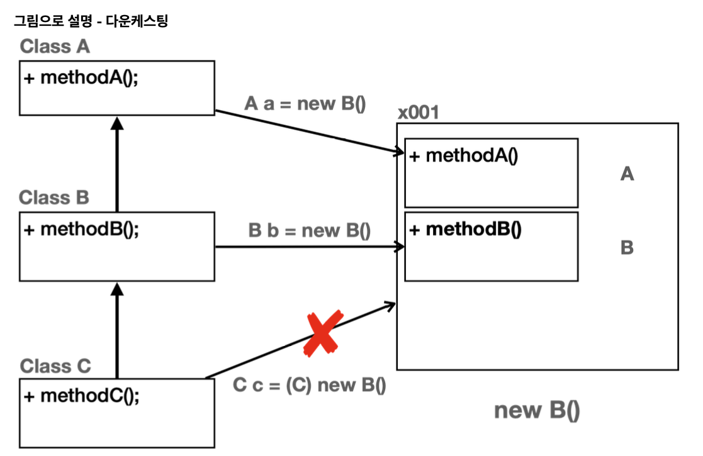
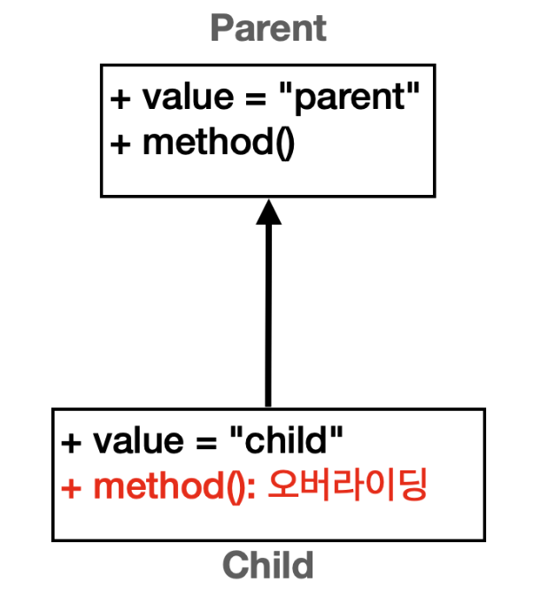
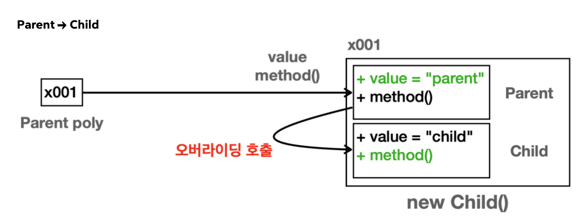

# 다형성1

## 다형성 시작
객체지향 프로그래밍의 대표적인 특징으로는 캡슐화, 상속, 다형성이 있다. 그 중에서 다형성은 객체지향 프로그래밍의 꽃이라 불린다.
앞서 학습한 캡슐화나 상속은 직관적으로 이해하기 쉽다. 반면에 다형성은 제대로 이해하기도 어렵고, 잘 활용하기는 더 어렵다. 하지만 좋은 개발자가 되기 위해서는 다형성에 대한 이해가 필수다.

**다형성(Polymorphism)** 은 이름 그대로 "다양한 형태", "여러 형태"를 뜻한다.
프로그래밍에서 다형성은 한 객체가 여러 타입의 객체로 취급될 수 있는 능력을 뜻한다. 보통 하나의 객체는 하나의 타입으로 고정되어 있다. 그런데 다형성을 사용하면 하나의 객체가 다른 타입으로 사용될 수 있다는 뜻이다. 

다형성을 이해하기 위해서는 크게 2가지 핵심 이론을 알아야 한다.
- 다형적 참조
- 메서드 오버라이딩

### 다형적 참조
부모는 자식을 품을 수 있다.
자식은 부모를 담을 수 없다.

부모 클래스인 `Parent`, 그를 상속받는 `Child` 클래스가 있다.

각자의 타입의 변수가 각자의 인스턴스 참조 하는것은 다 아는 사실이다.

근데 자식 타입의 변수가 자식 인스턴스 참조 하는 경우는 조금 달랐다.

메모리상 이런 그림이 나온다. 하나하나씩 뜯어보면 
- `Child child = new Child()`
- `Child`인스턴스를 만들었다. 이 경우 자식 타입인 `Child`를 생성했기 때문에 메모리 상에 `Child`와 `Parent`가 모두 생성된다.
- 생성된 참조값을 `Child`타입의 변수인 `child`에 담아둔다.
- `child.childMethod()`를 호출하면 인스턴스의 `Child`클래스에 있는 `childMetdho()`가 호출된다.

그리고 핵심 내용이 등장한다.

**다형적 참조: 부모 타입의 변수가 자식 인스턴스 참조**

- 부모 타입의 변수가 자식 인스턴스를 참조한다.
- `Parent poly = new Child()`
- `Child`인스턴스를 만들었다. 이 경우 자식 타입인 `Child`를 생성했기 때문에 메모리 상에 `Child`와 `Parent`가 모두 생성된다.
- 생성된 참조값을 `Parent`타입의 변수인 `poly`에 담아둔다. 

**부모는 자식을 담을 수 있다.**
- 부모 타입은 자식 타입을 담을 수 있다.
- `Parent poly`는 부모 타입이다. `new Child()`를 통해 생성된 결과는 `Child`타입이다. 자바에서 부모 타입은 자식 타입을 담을 수 있다!
	- `Parent poly = new Child()`: 성공
- 반대로 자식 타입은 부모 타입을 담을 수 없다.
	- `Child child1 = new Parent()`: 컴파일 오류 발생

**다형적 참조**

지금까지 학습한 내용을 떠올려보면 항상 같은 타입에 참조를 대입했다. 그래서 보통 한 가지 형태만 참조할 수 있다.
그런데 `Parent`타입의 변수는 자신인 `Parent`는 물론이고, 자식 타입까지 참조할 수 있다. 만약 손자가 있다면 손자까지 가능하다.
자바에서 부모 타입은 자신은 물론이고, 자신을 기준으로 모든 자식 타입을 참조할 수 있다. 이것이 바로 다양한 형태를 참조할 수 있다고 해서 다형적 참조라 한다.

**다형적 참조와 인스턴스 실행**

`poly.parentMethod()`를 호출하면 먼저 참조값을 사용해서 인스턴스를 찾는다. 그리고 다음으로 인스턴스 안에서 실행할 타입도 찾아야 한다. `poly`는 `Parent`타입이다. 따라서 `Parent`클래스부터 시작해서 필요한 기능을 찾는다. 인스턴스 `Parent`클래스에 `parentMethod()`가 있다. 따라서 해당 메서드가 호출된다. 

**다형적 참조의 한계**

**Parent -> Child:poly.childMethod()**


`Parent poly = new Child()`이렇게 자식을 참조한 상황에서 `poly`가 자식 타입인 `Child`에 있는 `childMethod()`를 호출하면 어떻게 될까?
`poly.childMethod()`를 실행하면 먼저 참조값을 통해 인스턴스를 찾는다. 그리고 다음으로 인스턴스 안에서 실행할 타입을 찾아야 한다. 호출자인 `poly`는 `Parent`타입이다. 따라서 `Parent`클래스부터 시작해서 필요한 기능을 찾는다. 그런데 상속 관계는 부모 방향으로 찾아 올라갈 수는 있지만 자식 방향으로 찾아 내려갈 수는 없다. `Parent`는 부모 타입이고 상위에 부모가 없다. 따라서 `childMethod()`를 찾을 수 없으므로 컴파일 오류가 발생한다.

이런 경우 `childMethod()`를 호출하고 싶으면 어떻게 해야할까? 바로 캐스팅이 필요하다.

**다형적 참조의 핵심은 부모는 자식을 품을 수 있다는 것이다.**

그런데 이런 다형적 참조가 왜 필요하지? 라는 의문이 들 수 있다. 이 부분은 다형성의 다른 이론들도 함께 알아야 이해 할 수 있다. 지금은 우선 다형성의 문법과 이론을 익히는데 집중하자.

## 다형성과 캐스팅
`Parent poly = new Child()`와 같이 부모 타입의 변수를 사용하게 되면 `poly.childMethod()`와 같이 자식 타입에 있는 기능은 호출할 수 없다.
```java
package poly.basic;
public class CastingMain1 {
    public static void main(String[] args) {
        //부모 변수가 자식 인스턴스 참조(다형적 참조)
        Parent poly = new Child();
        //단 자식의 기능은 호출할 수 없다. 컴파일 오류 발생
        //poly.childMethod();
        
        //다운캐스팅(부모 타입 -> 자식 타입)
        Child child = (Child) poly;
        child.childMethod();
    }
}
```

- `poly.childMethod()`를 호출하면 먼저 참조값을 사용해서 인스턴스를 찾는다.
- 인스턴스 안에서 사용할 타입을 찾아야 한다. `poly`는 `Parent`타입이다. 
- `Parent`는 최상위 부모이다. 상속 관계는 부모로만 찾아서 올라갈 수 있다. `childMethod()`는 자식 타입에 있으므로 호출할 수 없다. 따라서 컴파일 오류가 발생한다.

**다운캐스팅**


호출하는 타입을 자식인 `Child`타입으로 변경하면 인스턴스의 `Child`에 있는 메서드를 호출할 수 있다. 하지만 다음과 같은 문제에 봉착한다.

**부모는 자식을 담을 수 있지만 자식은 부모를 담을 수 없다.**
- `Parent parent = new Child()`: 부모는 자식을 담을 수 있다.
- `Parent parent = child // Child child 변수`: 부모는 자식을 담을 수 있다.

반면에 다음고 같이 자식은 부모를 담을 수 없다.

`Child child = poly // Parent poly 변수`

부모 타입을 사용하는 변수를 자식 타입에 대입하려고 하면 컴파일 오류가 발생한다. 자식은 부모를 담을 수 없다.
이때는 다운캐스팅이라는 기능을 사용해서 부모 타입을 잠깐 자식 타입으로 변경하면 된다.

`Child child = (Child) poly // Parent poly`

참고로 캐스팅을 한다고 해서 `Parent poly`의 타입이 변하는 것은 아니다. 해당 참조값을 꺼내고 꺼낸 참조값이 `Child`타입이 되는 것이다. 따라서 `poly`의 타입은 `Parent`로 기존과 같이 유지된다.

**캐스팅**
- 업캐스팅(upcasting): 부모 타입으로 변경
- 다운캐스팅(downcasting): 자식 타입으로 변경

"캐스팅"은 영어 단어 "cast"에서 유래되었다. "cast"는 금속이나 다른 물질을 녹여서 특정한 형태나 모양으로 만드는 과정을 의미한다.

**개발자인 내가 책임질게 자바야 그냥 봐줘 그게 바로 다운캐스팅이다.**

## 캐스팅의 종류

### 일시적 다운 캐스팅

다운캐스팅 결과를 변수에 담아두는 과정이 번거롭다. 이런 과정 없이 일시적으로 다운캐스팅을 해서 인스턴스에 있는 하위 클래스의 기능을 바로 호출할 수 있다.

`((Child) poly).childMethod()`


이렇게 일시적 다운캐스팅을 사용하면 별도의 변수 없이 인스턴스의 자식 타입의 기능을 사용할 수 있다.

`((Child) poly).childMethod();`
연산자 우선순위 가 `poly.childMethod()`가 높다. 그래서 `poly`앞에 `(Child)`를 해주는것이다.

### 업캐스팅
다운캐스팅과 반대로 현재 타입을 부모 타입으로 변경하는 것을 업캐스팅이라 한다.

**업캐스팅은 생략할 수 있다. 다운캐스팅은 생략할 수 없다. 참고로 업캐스팅은 매우 자주 사용하기 때문에 생략을 권장한다.**

자바에서 부모는 자식을 담을 수 있다. 하지만 그 반대는 안된다. (꼭 필요하다면 다운캐스팅을 해야 한다.)

## 다운캐스팅과 주의점
다운캐스팅은 잘못하면 심각한 런타임 오류가 발생할 수 있다.

```java
Parent parent2 = new Parent()
```
먼저 `new Parent()`로 부모 타입으로 객체를 생성한다. 따라서 메모리 상에 자식 타입은 전혀 존재하지 않는다. 생성 결과를 `parent2`에 담아둔다. 이 경우 같은 타입이므로 여기서는 문제가 발생하지 않는다. 
```java
Child child2 = (Child) parent2
```
다음으로 `parent2`를 `Child`타입으로 다운캐스팅한다. 그런데 `parent2`는 `Parent`로 생성이 되었다. 따라서 메모리 상에 `Child`자체가 존재하지 않는다. `Child`자체를 사용할 수 없는 것이다. 


`parent2`를 다운캐스팅하면 `ClassCastException`이라는 심각한 런타임 오류가 발생한다. 

자바에서는 이렇게 사용할 수 없는 타입으로 다운캐스팅하는 경우에 `ClassCastException`이라는 예외를 발생시킨다. 예외가 발생하면 다음 동작이 실행되지 않고, 프로그램이 종료된다. 따라서 다음 코드가 있다고 가정하면 `child2.childMethod()`코드 자체가 실행 되지 않는다.

### 업캐스팅이 안전하고 다운캐스팅이 위험한 이유
업캐스팅의 경우 이런 문제가 절대로 발생하지 않는다. 왜냐하면 객체를 생성하면 해당 타입의 상위 부모 타입은 모두 함께 생성된다! 따라서 위로만 타입을 변경하는 업캐스팅은 메모리 상에 인스턴스가 모두 존재하기 때문에 항상 안전하다. 따라서 캐스팅을 생략할 수 있다.

반면에 다운캐스팅의 경우 인스턴스에 존재하지 않는 하위 타입으로 캐스팅하는 문제가 발생할 수 있다. 왜냐하면 객체를 생성하면 부모 타입은 모두 함께 생성되지만 자식 타입은 생성되지 않는다. 따라서 개발자가 이런 문제를 인지하고 사용해야 한다는 의미로 명시적으로 캐스팅을 해주어야 한다.

클래스 A,B,C는 상속 관계다.

`new C()`로 인스턴스를 생성하면 인스턴스 내부에 자신과 부모인 A, B, C가 모두 생성된다. 따라서 C의 부모 타입인 A, B, C 모두 C 인스턴스를 참조할 수 있다. 상위로 올라가는 업캐스팅은 인스턴스 내부에 부모가 모두 생성되기 때문에 문제가 발생하지 않는다.
- `A a = new C()`: A로 업캐스팅
- `B b = new C()`: B로 업캐스팅
- `C c = new C()`: 자신과 같은 타입


객체를 생성할 때 하위 자식은 생성되지 않기 때문에 하위로 내려가는 다운캐스팅은 인스턴스 내부에 없는 부분을 선태하는 문제가 발생할 수 있다.
- `A a = new B()`: A로 업캐스팅
- `B b = new B()`: 자신과 같은 타입
- `C c = new B()`: 하위 타입은 대입할 수 없음, **컴파일 오류**
- `C c = (C) new B()`: 하위 타입으로 강제 다운캐스팅, 하지만 B 인스턴스에 C에 관련된 부분이 없으므로 잘못된 캐스팅, `ClassCastException` **런타임 오류 발생**

**컴파일 오류 vs 런타임 오류**
컴파일 오류는 변수명 오타, 잘못된 클래스 이름 사용등 자바 프로그램을 실행하기 전에 발생하는 오류이다. 이런 오류는 IDE에서 즉시 확인할 수 있기 때문에 안전하고 좋은 오류이다.

반면에 런타임 오류는 이름 그대로 프로그램이 실행되고 있는 시점에 발생하는 오류이다. 런타임 오류는 매우 안좋은 오류이다. 왜냐하면 보통 고객이 해당 프로그램을 실행하는 도중에 발생하기 때문이다.

## instanceof
다형성에서 참조형 변수는 이름 그대로 다양한 자식을 참조할 수 있다. 참조하는 대상이 다양하기 때문에 어떤 인스턴스를 참조하고 있는지 확인하기 위해서는 `instanceof`키워드를 사용하면 된다.

```java
package poly.basic;

public class CastingMain5 {
    
    public static void main(String[] args) {
        Parent parent1 = new Parent();
        System.out.println("parent1 호출");
        call(parent1);
        
        Parent parent2 = new Child();
        System.out.println("parent2 호출");
        call(parent2);
    }

    private static void call(Parent parent) {
        parent.parentMethod();
        
        if (parent instanceof Child) {
            System.out.println("Child 인스턴스 맞음");
            Child child = (Child) parent;
            child.childMethod();
        }
    }
}
```
다운캐스팅을 수행하기 전에는 먼저 `instanceof`를 사용해서 원하는 타입으로 변경이 가능한지 확인한 다음에 다운캐스팅을 수행하는 것이 안전하다.


`instanceof`키워드는 오른쪽 대상의 자식 타입을 왼쪽에서 참조하는 경우에도 `true`를 반환한다. 
```java
parent instanceof Parent //parent는 Child의 인스턴스

new Parent() instanceof Parent //parent가 Parent의 인스턴스를 참조하는 경우: true
new Child() instanceof Parent //parent가 Child의 인스턴스를 참조하는 경우: true
```
쉽게 이야기해서 오른쪽 있는 타입에 왼쪽에 있는 인스턴스의 타입이 들어갈 수 있는지 대입해보면 된다. 대입이 가능하면 `true`, 불가능하면 `false`가 된다.
```java
new Parent() instanceof Parent
Parent p = new Parent() // 같은 타입 true

new Child() instanceof Parent
Parent p = new Child() // 부모는 자식을 담을 수 잇다. 

new Parent() instanceof Child
Child c = new Parent() // 자식은 부모를 담을 수 없다. false

new Child() instanceof Child
Child c = new Child() // 같은 타입 true
```

### 자바 16 - Pattern Matching for instanceof
자바 16부터는 `instanceof`를 사용하면서 동시에 변수를 선언할 수 있다. 

```java
package poly.basic;

public class CastingMain6 {
    
    public static void main(String[] args) {
        Parent parent1 = new Parent();
        System.out.println("parent1 호출");
        call(parent1);
        
        Parent parent2 = new Child();
        System.out.println("parent2 호출");
        call(parent2);
    }

    private static void call(Parent parent) {
        parent.parentMethod();
        
        //Child 인스턴스인 경우 childMethod() 실행
        if (parent instanceof Child child) {
            System.out.println("Child 인스턴스 맞음");
            child.childMethod();
        }
    }
}
```
덕분에 인스턴스가 맞는 경우 직접 다운캐스팅 하는 코드를 생략할 수 있다.

## 다형성과 메서드 오버라이딩
다형성을 이루는 또 하나의 중요한 핵심 이론은 바로 메서드 오버라이딩이다.

메서드 오버라이딩에서 꼭! 기억해야 할 점은 **오버라이딩 된 메서드가 항상 우선권을 가진다**는 점이다.

그래서 이름도 기존 기능을 덮어 새로운 기능을 재정의 한다는 뜻의 오버라이딩이다.


앞서 메서드 오버라이딩을 학습했지만 지금까지 학습한 메서드 오버라이딩 반쪽짜리다. 메서드 오버라이딩의 진짜 힘은 다형성과 함께 사용할 때 나타난다. 다음 코드를 토앻 다형성과 메서드 오버라이딩을 알아보자.


- `Parent`, `Child`모두 `value`라는 같은 멤버 변수를 가지고 있다.
    - 멤버 변수는 오버라이딩 되지 않는다.
- `Parent`, `Child`모두 `method()`라는 메서드를 가지고 있다. `Child`에서 메서드를 오버라이딩 했다.
    - 메서드는 오버라이딩 된다.

예시
```java
//부모 변수가 자식 인스턴스 참조(다형적 참조)
Parent poly = new Child();
System.out.println("Parent -> Child");
System.out.println("value = " + poly.value); //변수는 오버라이딩X
poly.method(); //메서드 오버라이딩!
```

- **이 부분이 중요하다.**
- `poly`변수는 `Parent`타입이다. 따라서 `poly.value`, `poly.method()`를 호출하면 인스턴스의 `Parent`타입에서 기능을 찾아서 실행한다.
    - `poly.value`: `Parent`타입에 있는 `value`값을 읽는다.
    - `poly.method()`: `Parent`타입에 있는 `method()`를 실행하려고 한다. 그런데 하위 타입인 `Child.method()`가 오버라이딩 되어 있다. **오버라이딩 된 메서드는 항상 우선권**을 가진다. 따라서 `Parent.method()`가 아니라 `Child.method()`가 실행된다.

**오버라이딩 된 메서드는 항상 우선권을 가진다.**

오버라이딩이 부모 -> 자식 -> 손자까지 있으면 손자의 오버라이딩 메서드가 우선권을 가진다. 
즉, 더 하위 자식의 오버라이딩 된 메서드가 우선권을 가지는 것이다.

## 정리
지금까지 다형성을 이루는 핵심 이론인 다형적 참조와 메서드 오버라이딩에 대해 학습했다.
- **다형적 참조**: 하나의 변수 타입으로 다양한 자식 인스턴스를 참조할 수 있는 기능
- **메서드 오버라이딩**: 기존 기능을 하위 타입에서 새로운 기능으로 재정의

이 둘을 이해하고 나면 진정한 다형성의 위력을 맛볼 수 있다.