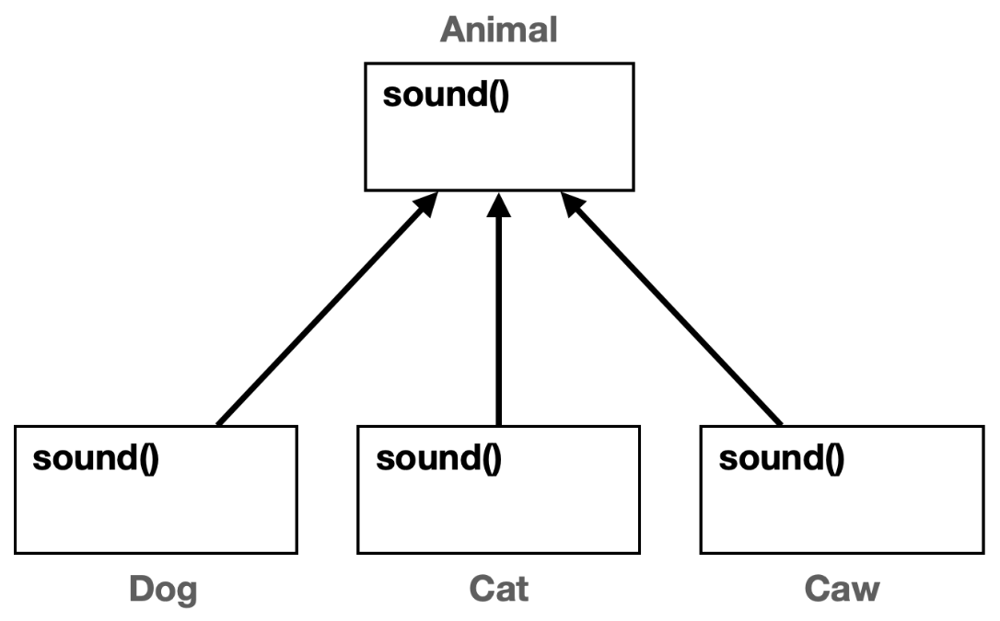

# 11. 다형성 2

## 다형성 활용 1
각기 다른 동물이 있다. `Dog`, `Cat`, `Cow`
하지만 동물이고 우는 기능은 다들 가지고 있다. 

### 중복 제거 시도
**메서드로 중복 제거 시도**

**배열과 for문을 통한 중복 제거 시도**

하지만 이 2가지 방법을 시도하려면 전제조건이 필요하다. 그것은 바로 **타입이 다르기에 같아야 한다는 점**

모두 같은 타입을 사용한다면 해결이 된다. 여기서 다형성이 나온다.
다형성의 핵심은 다형적 참조와 메서드 오버라이딩이다 이 둘을 활용하면 가능하다.

## 다형성 활용 2



`Animal`이라는 부모 클래스를 만들고 `sound()`메서드를 정의한다. 이 메서드는 자식 클래스에서 오버라이딩 할 목적으로 만들었다.

동물 소리 테스트를 시작과 종료를 알리는 메서드가 있다. 이것을 메서드로 중복을 제거를 시도했다.

```java
//동물이 추가 되어도 변하지 않는 코드
private static void soundAnimal(Animal animal) {
    System.out.println("동물 소리 테스트 시작");
    animal.sound();
    System.out.println("동물 소리 테스트 종료");
}
```
이 코드의 핵심은 `Animal animal`부분이다.
- **다형적 참조** 덕분에 `animal`변수는 자식인 `Dog`, `Cat`, `Cow`의 인스턴스를 참조할 수 있다. (부모는 자식을 담을 수 있다.)
- **메서드 오버라이딩**덕분에 `animal.sound()`를 호출해도 `Dog.sound()`, `Cat.sound()`, `Cow.sound()`와 같이 각 인스턴스의 메서드를 호출할 수 있다. 

## 다형성 활용 3

이번에는 배열과 for문을 사용해서 중복을 제거했다.

```java
Animal[] animalArr = {dog, cat, caw};
//변하지 않는 부분
for (Animal animal : animalArr) {
    System.out.println("동물 소리 테스트 시작");
    animal.sound();
    System.out.println("동물 소리 테스트 종료");
}
```
배열은 같은 타입의 데이터를 나열할 수 있다. 
`Dog` , `Cat` , `Cow` 는 모두 `Animal` 의 자식이므로 `Animal` 타입이다.
다형적 참조 덕분에 가능하다.

### 조금 더 개선
배열과 메서드 모두 활용해서 기존 코드 개선
```java
public static void main(String[] args) {
    Animal[] animalArr = {new Dog(), new Cat(), new Caw()};
    
    for (Animal animal : animalArr) {
        soundAnimal(animal);
    }
}
//동물이 추가 되어도 변하지 않는 코드
private static void soundAnimal(Animal animal) {
    System.out.println("동물 소리 테스트 시작");
    animal.sound();
    System.out.println("동물 소리 테스트 종료");
}
```

새로운 동물이 추가되어도 `soundAnimal(..)`메서드는 코드 변경 없이 유지할 수 있다. 이렇게 할 수 있는 이유는 이 메서드는 `Animal`이라는 추상적인 부모를 참조하기 때문이다. 따라서 `Animal`을 상속 받은 새로운 동물이 추가되어도 이 메서드의 코드는 변경 없이 유지할 수 있다.

새로운 기능이 추가되었을 때 변하는 부분을 최소화 하는 것이 잘 작성된 코드이다. 이렇게 하기 위해서는 코드에서 변하는 부분과 변하지 않는 부분을 명확하게 구분하는 것이 좋다.

**남은 문제**
- `Animal`클래스를 생성할 수 있는 문제

    추상적인 개념인 동물 클래스는 다형성을 위해 필요한 것이지 직접 인스턴스를 생성해서 사용할 일은 없다.

- `Animal`클래스를 상속 받는 곳에서 `sound()`메서드 오버라이딩을 하지 않을 가능성

    다른 동물의 클래스를 만들었는데 개발자 실수로 `sound()`메서드를 오버라이딩 하지 않았다면? 그럼 부모 클래스의 `sound()`메서드가 실행되어 이상하게 될 것이다.

좋은 프로그램은 제약이 있는 프로그램이다. 추상 클래스와 추상 메서드를 사용하면 이런 문제를 한번에 해결할 수 있다.

## 추상 클래스 1

**추상 클래스**

추상 클래스는 이름 그대로 추상적인 개념을 제공하는 클래스이다. 따라서 실체인 인스턴스가 존재하지 않는다. 대신에 상속을 목적으로 사용되고, 부모 클래스 역할을 담당한다.
```java
abstract class AbstractAnimal {...}
```
`abstract` 키워드를 클래스 앞에 선언해주기

**추상 메서드**

부모 클래스를 상속 받는 자식 클래스가 반드시 오버라이딩 해야 하는 메서드를 부모 클래스에 정의할 수 이싿. 이것을 추상 메서드라 한다. 이름 그대로 추상적인 개념을 제공하는 메서드이다. 따라서 실체가 존재하지 않고, 메서드 바디가 없다.
```java
public abstract void sound();
```
접근제어자 뒤 메서드 반환값 앞에 `abstract`키워드를 붙여주면 된다. 뭐 쓰다 보면 익숙해진다. 그냥 메서드 앞에 추상적인 의미를 붙인다 생각하면 편한다.

**추상 메서드가 하나라도 있는 클래스는 추상 클래스로 선언해야 한다.**
- 안그러면 컴파일 오류
- 추상 메서드 바디가 없다. 따라서 작동하지 않는 메서드를 가진 불완전한 클래스로 볼 수 있다. 따라서 직접 생성하지 못하도록 추상 클래스로 선언해야 한다.

**추상 메서드는 상속 받는 자식 클래스가 반드시 오버라딩 해서 사용해야 한다.**
- 바디 부분이 없기 때문에 컴파일 오류가 난다. 


## 추상 클래스 2
## 인터페이스
## 인터페이스 - 다중 구현
## 클래스와 인터페이스 활용
## 정리


