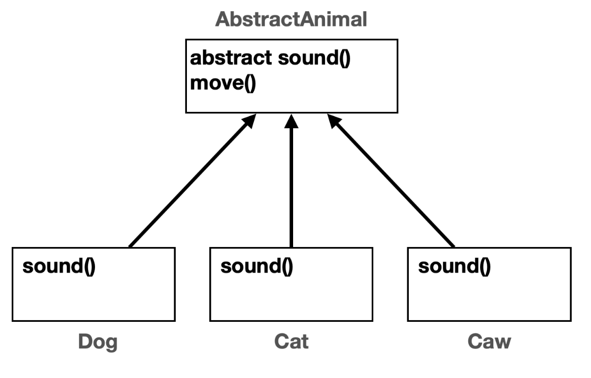
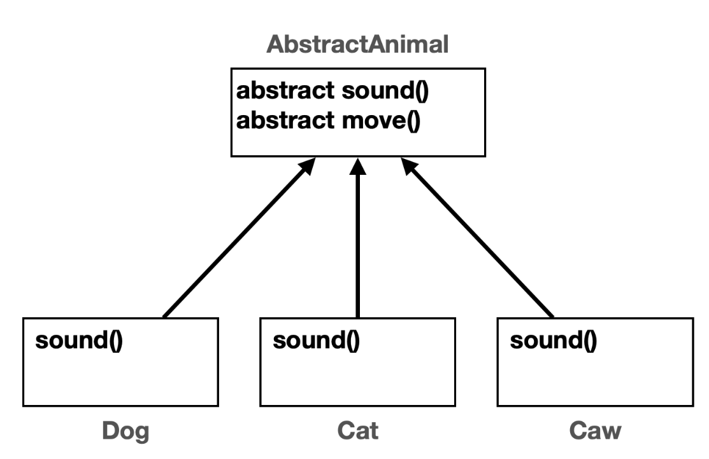
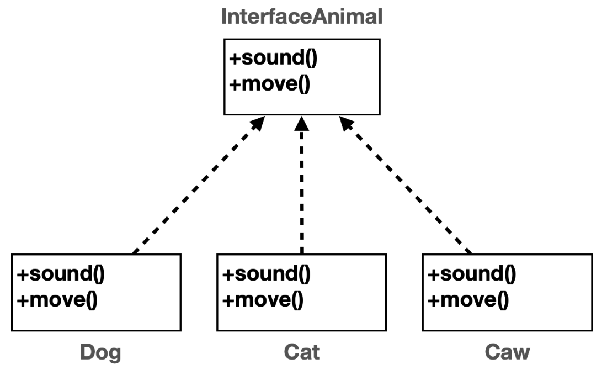

# 11. 다형성 2

## 다형성 활용 1
각기 다른 동물이 있다. `Dog`, `Cat`, `Cow`
하지만 동물이고 우는 기능은 다들 가지고 있다. 

### 중복 제거 시도
**메서드로 중복 제거 시도**

**배열과 for문을 통한 중복 제거 시도**

하지만 이 2가지 방법을 시도하려면 전제조건이 필요하다. 그것은 바로 **타입이 다르기에 같아야 한다는 점**

모두 같은 타입을 사용한다면 해결이 된다. 여기서 다형성이 나온다.
다형성의 핵심은 다형적 참조와 메서드 오버라이딩이다 이 둘을 활용하면 가능하다.

## 다형성 활용 2


`Animal`이라는 부모 클래스를 만들고 `sound()`메서드를 정의한다. 이 메서드는 자식 클래스에서 오버라이딩 할 목적으로 만들었다.

동물 소리 테스트를 시작과 종료를 알리는 메서드가 있다. 이것을 메서드로 중복을 제거를 시도했다.

```java
//동물이 추가 되어도 변하지 않는 코드
private static void soundAnimal(Animal animal) {
    System.out.println("동물 소리 테스트 시작");
    animal.sound();
    System.out.println("동물 소리 테스트 종료");
}
```
이 코드의 핵심은 `Animal animal`부분이다.
- **다형적 참조** 덕분에 `animal`변수는 자식인 `Dog`, `Cat`, `Cow`의 인스턴스를 참조할 수 있다. (부모는 자식을 담을 수 있다.)
- **메서드 오버라이딩**덕분에 `animal.sound()`를 호출해도 `Dog.sound()`, `Cat.sound()`, `Cow.sound()`와 같이 각 인스턴스의 메서드를 호출할 수 있다. 

## 다형성 활용 3

이번에는 배열과 for문을 사용해서 중복을 제거했다.

```java
Animal[] animalArr = {dog, cat, caw};
//변하지 않는 부분
for (Animal animal : animalArr) {
    System.out.println("동물 소리 테스트 시작");
    animal.sound();
    System.out.println("동물 소리 테스트 종료");
}
```
배열은 같은 타입의 데이터를 나열할 수 있다. 
`Dog` , `Cat` , `Cow` 는 모두 `Animal` 의 자식이므로 `Animal` 타입이다.
다형적 참조 덕분에 가능하다.

### 조금 더 개선
배열과 메서드 모두 활용해서 기존 코드 개선
```java
public static void main(String[] args) {
    Animal[] animalArr = {new Dog(), new Cat(), new Caw()};
    
    for (Animal animal : animalArr) {
        soundAnimal(animal);
    }
}
//동물이 추가 되어도 변하지 않는 코드
private static void soundAnimal(Animal animal) {
    System.out.println("동물 소리 테스트 시작");
    animal.sound();
    System.out.println("동물 소리 테스트 종료");
}
```

새로운 동물이 추가되어도 `soundAnimal(..)`메서드는 코드 변경 없이 유지할 수 있다. 이렇게 할 수 있는 이유는 이 메서드는 `Animal`이라는 추상적인 부모를 참조하기 때문이다. 따라서 `Animal`을 상속 받은 새로운 동물이 추가되어도 이 메서드의 코드는 변경 없이 유지할 수 있다.

새로운 기능이 추가되었을 때 변하는 부분을 최소화 하는 것이 잘 작성된 코드이다. 이렇게 하기 위해서는 코드에서 변하는 부분과 변하지 않는 부분을 명확하게 구분하는 것이 좋다.

**남은 문제**
- `Animal`클래스를 생성할 수 있는 문제

    추상적인 개념인 동물 클래스는 다형성을 위해 필요한 것이지 직접 인스턴스를 생성해서 사용할 일은 없다.

- `Animal`클래스를 상속 받는 곳에서 `sound()`메서드 오버라이딩을 하지 않을 가능성

    다른 동물의 클래스를 만들었는데 개발자 실수로 `sound()`메서드를 오버라이딩 하지 않았다면? 그럼 부모 클래스의 `sound()`메서드가 실행되어 이상하게 될 것이다.

좋은 프로그램은 제약이 있는 프로그램이다. 추상 클래스와 추상 메서드를 사용하면 이런 문제를 한번에 해결할 수 있다.

## 추상 클래스 1

**추상 클래스**

추상 클래스는 이름 그대로 추상적인 개념을 제공하는 클래스이다. 따라서 실체인 인스턴스가 존재하지 않는다. 대신에 상속을 목적으로 사용되고, 부모 클래스 역할을 담당한다.
```java
abstract class AbstractAnimal {...}
```
`abstract` 키워드를 클래스 앞에 선언해주기

**추상 메서드**

부모 클래스를 상속 받는 자식 클래스가 반드시 오버라이딩 해야 하는 메서드를 부모 클래스에 정의할 수 이싿. 이것을 추상 메서드라 한다. 이름 그대로 추상적인 개념을 제공하는 메서드이다. 따라서 실체가 존재하지 않고, 메서드 바디가 없다.
```java
public abstract void sound();
```
접근제어자 뒤 메서드 반환값 앞에 `abstract`키워드를 붙여주면 된다. 뭐 쓰다 보면 익숙해진다. 그냥 메서드 앞에 추상적인 의미를 붙인다 생각하면 편한다.

**추상 메서드가 하나라도 있는 클래스는 추상 클래스로 선언해야 한다.**
- 안그러면 컴파일 오류
- 추상 메서드 바디가 없다. 따라서 작동하지 않는 메서드를 가진 불완전한 클래스로 볼 수 있다. 따라서 직접 생성하지 못하도록 추상 클래스로 선언해야 한다.

**추상 메서드는 상속 받는 자식 클래스가 반드시 오버라딩 해서 사용해야 한다.**
- 바디 부분이 없기 때문에 컴파일 오류가 난다. 
- 오버라이딩 하지 않으면 자식도 추상 클래스가 되어야 한다.

추상 메서드는 기존 메서드와 완전히 같다. 다만 메서드 바디가 없고, 자식 클래스가 해당 메서드를 반드시 오버라이딩 해야 한다는 제약이 추가된 것이다.

그럼 이런 그림이 나온다. 


*정리*
- 추상 클래스 덕분에 실수로 `Animal`인스턴스를 생성할 문제를 근본적으로 방지해준다.
- 추상 메서드 덕분에 새로운 동물의 자식 클래스를 만들때 실수로 `sound()`를 오버라이딩 하지 않을 문제를 근본적으로 방지해준다.

## 추상 클래스 2
**순수 추상 클래스: 모든 메서드가 추상 메서드인 추상 클래스**

그럼 위에서 `move()`메서드는 일반 메서드였는데 이는 추상 클래스 안에 모든 메서드가 추상 메서드만 존재한다.


순수 추상 클래스는 코드를 실행할 바디 부분이 전혀 없다.
단지 다형성을 위한 부모 타입으로써 껍데기 역할만 제공할 뿐이다.

특징
- 인스턴스를 생성할 수 없다.
- 상속시 자식은 모든 메서드를 오버라이딩 해야 한다.
- 주로 다형성을 위해 사용된다.

**상속하는 클래스는 모든 메서드를 구현해야 한다.**

순수 추상 클래스는 마치 어떤 규격을 지켜서 구현해야 하는 것 처럼 느껴진다.
이것은 우리가 일반적으로 이야기하는 인터페이스와 같이 느껴진다. 예를 들어서 USB 인터페이스를 생각해보자. USB 인터페이스는 분명한 규격이 있다. 이 규격에 맞추어 제품을 개발해야 연결이 된다. 순수 추상 클래스가 USB 인터페이스 규격이라고 한다면 USB 인터페이스에 맞추어 마우스, 키보드 같은 연결 장치들을 구현할 수 있다.

사실 자바 용어에는 순수 추상 클래스가 없다. 이는 옛날 프로그래밍 언어의 용어이다. 
자바에는 인터페이스라는 용어로 쓰인다.

## 인터페이스
자바는 순수 추상 클래스를 더 편리하게 사용할 수 있는 인터페이스라는 기능을 제공한다.

인터페이스는 `class`가 아니라 `interface`키워드를 사용하면 된다.

인터페이스의 특징
- 인터페이스의 메서드는 모두 `public`, `abstract`이다.
- 메서드에 `public abstract`를 생략할 수 있다. 참고로 생략이 권장 된다.
- 인터페이스는 다중 구현 (다중 상속)을 지원한다.

**인터페이스**
```java
public interface InterfaceAnimal {
    public abstract void sound();
    public abstract void move();
}
```
**인터페이스 - public abstract 키워드 생략 가능** 
```java
public interface InterfaceAnimal {
    void sound();
    void move();
}
```

**인터페이스와 멤버 변수** 
```java
public interface InterfaceAnimal {
    public static final double MY_PI = 3.14;
}
```
인터페이스에서 멤버 변수는 `public`, `static`, `final`이 모두 포함되었다고 간주된다. `final`은 변수의 값을 한번 설정하면 수정할 수 없다는 뜻이다.
자바에서 `static final`을 사용해 정적이면서 고칠 수 없는 변수를 상수라 하고, 관례상 상수는 대무나에 언더스코어(`_`)로 구분한다.

해당 키워드는 다음과 같이 생략할 수 있다. (생략이 권장된다.) 
```java
public interface InterfaceAnimal {
    double MY_PI = 3.14;
}
```

인터페이스의 그림은 다음과 같다.

클래스 상속 관계는 UML에서 실선을 사용하지만, 인터페이스 구현(상속)관계는 UML에서 점선을 사용한다.

인터페이스를 상속 받을 때는 `extends` 대신에 `implements`라는 **구현**이라는 키워드를 사용해야 한다. 

인터페이스는 상속이 아니라 구현이라고 한다. 왜냐하면 인터페이스가 부모이면 그것을 상속받아서 쓰는게 아니라 다 구현해서 써야 하므로 그렇다.

```java
package poly.ex5;

public class Dog implements InterfaceAnimal {
    @Override
    public void sound() { 
        System.out.println("멍멍");
    }
    
    @Override
    public void move() {
        System.out.println("개 이동"); 
    }
}
```

앞서 설명한 순수 추상 클래스 예제와 거의 유사하다. 순수 추상 클래스가 인터페이스가 되었을 뿐이다.

**클래스, 추상 클래스, 인터페이스는 모두 똑같다.**

- 클래스, 추상 클래스, 인터페이스는 프로그램 코드, 메모리 구조상 모두 똑같다. 모두 자바에서는 `.class`로 다루어진다. 인터페이스를 작성할 때도 `.java`에 인터페이스를 정의한다. 
- 인터페이스는 순수 추상 클래스와 비슷하다고 생각하면 된다. 

**상속 vs 구현**

인터페이스는 모든 메서드가 추상 메서드이다. 따라서 물려받을 수 있는 기능이 없고, 오히려 인터페이스에 정의한 모든 메서드를 자식이 오버라이딩 해서 기능을 구현해야 한다. 따라서 구현한다고 표현한다. 

인터페이스는 메서드 이름만 있는 설계도이고, 이 설계도가 실제 어떻게 작동하는지는 하위 클래스에서 모두 구현해야한다. 따라서 인터페이스의 경우 상속이 아니라 해당 인터페이스를 구현한다고 표현한다. 

상속과 구현은 사람이 표현하는 단어만 다를 뿐이지 자바 입장에서는 똑같다. 일반 상속 구조와 동일하게 작동한다. 

**인터페이스를 사용해야 하는 이유**

모든 메서드가 추상 메서드인 경우 순수 추상 클래스를 만들어도 되고, 인터페이스를 만들어도 된다. 그런데 왜 인터페이스를 사용해야 할까? 단순히 편리한다는 이유를 넘어서 다음과 같은 이유가 있다. 

- **제약**: 인터페이스를 만드는 이유는 인터페이스를 구현하는 곳에서 인터페이스의 메서드를 반드시 구현해라는 규약(제약)을 주는 것이다. USB 인터페이스를 생각해보자. USB 인터페이스


## 인터페이스 - 다중 구현
## 클래스와 인터페이스 활용
## 정리


