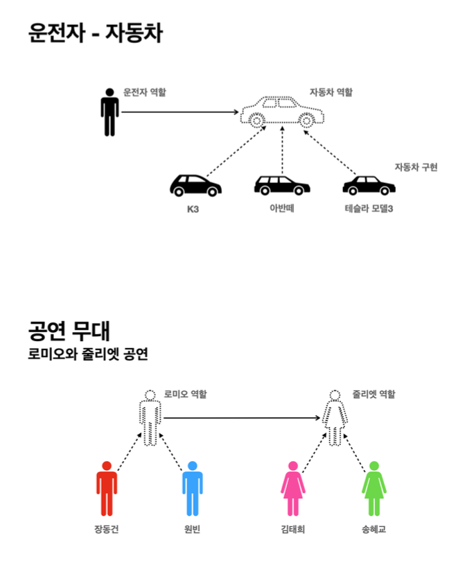
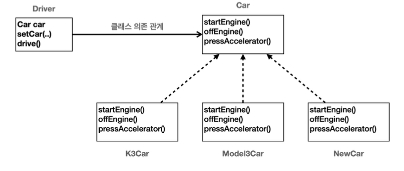

# 12. 다형성과 설계

## 좋은 객체 지향 프로그래밍이란?

### 객체 지향 특징
- 추상화
- 캡슐화
- 상속
- **다형성**

### 객체 지향 프로그래밍
- 객체 지향 프로그래밍은 컴퓨터 프로그램을 명령어의 목록으로 보는 시각에서 벗어나 여러개의 독립된 단위, 즉 "**객체**"들의 **모임**으로 파악하고자 하는 것이다. 각각의 **객체**는 **메시지**를 주고받고, 데이터를 처리할 수 있다. (**협력**)
- 객체 지향 프로그래밍은 프로그램을 **유연**하고 **변경**이 용이하게 만들기 때문에 대규모 소프트웨어 개발에 많이 사용된다.

### 유연하고, 변경이 용이?
- 레고 블럭 조립하듯이
- 키보드, 마우스 갈아 끼우듯이
- 컴퓨터 부품 갈아 끼우듯이
- 컴포넌트를 쉽고 유연하게 변경하면서 개발할 수 있는 방법

### 다형성의 실세계 비유
- 실세계와 객체 지향을 1:1로 매칭 X
- 그래도 실세계의 비유로 이해하기에는 좋음
- **역할**과 **구현**으로 세상을 구분

### 다형성의 실세계 비유
**예시**
- 운전자 - 자동차
- 공연 무대
- 키보드, 마우스, 세상의 표준 인터페이스들
- 정렬 알고리즘
- 할인 정책 로직

### 역할과 구현을 분리
- **역할**과 **구현**으로 구분하면 세상이 **단순**해지고, **유연**해지며 **변경**도 편리해진다.
- 장점
    - **클라이언트**는 대상의 역할(인터페이스)만 알면 된다.
    - **클라이언트**는 구현 대상의 **내부 구조를 몰라도** 된다.
    - **클라이언트**는 구현 대상의 **내부 구조가 변경**되어도 영향을 받지 않는다.
    - **클라이언트**는 구현 **대상 자체를 변경**해도 영향을 받지 않는다.

### 역할과 구현을 분리
**자바 언어**

- 자바 언어의 다형성을 활용
    - 역할 = 인터페이스
    - 구현 = 인터페이스를 구현한 클래스, 구현 객체
- 객체를 설계할 때 **역할**과 **구현**을 명확히 분리
- 객체 설계시 역할(인터페이스)을 먼저 부여하고, 그 역할을 수행하는 구현 객체 만들기

### 객체의 협력이라는 관계부터 생각
- 혼자 있는 객체는 없다.
- 클라이언트: **요청**, 서버: **응답**
- 수 많은 객체 클라이언트와 객체 서버는 서로 협력 관계를 가진다.

### 자바 언어의 다형성
- **오버라이딩**을 떠올려보자
- 오버라이딩은 자바 기본 문법
- 오버라이딩 된 메서드가 실행
- 다형성으로 인터페이스를 구현한 객체를 실행 시점에 유연하게 변경할 수 있다.
- 물론 클래스 상속 관계도 다형성, 오버라이딩 적용가능

### 다형성의 본질
- 인터페이스를 구현한 객체 인스턴스를 **실행 시점**에 **유연**하게 **변경**할 수 있다.
- 다형성의 본질을 이해하려면 **협력**이라는 객체사이의 관계에서 시작해야하마.

- **클라이언트를 변경하지 않고, 서버의 구현 기능을 유연하게 변경할 수 있다.**

### 역할과 구현을 분리
**정리**

- 실세계의 역할과 구현이라는 편리한 컨셉을 다형성을 통해 객체 세상으로 가져올 수 있음
- 유연하고, 변경이 용이
- 확장 가능한 설계
- 클라이언트에 영향을 주지 않는 변경 가능
- 인터페이스를 안정적으로 잘 설계하는 것이 중요

**한계**

- 역할(인터페이스) 자체가 변하면, 클라이언트, 서버 모두에 큰 변경이 발생한다.
- 자동차를 비행기로 변경해야 한다면?
- 대본 자체가 변경된다면?
- USB 인터페이스가 변경된다면?
- 인터페이스를 안정적으로 잘 설계하는 것이 중요

### 정리
- 다형성이 가장 중요하다!
- 디자인 패턴 대부분은 다형성을 활용하는 것이다.
- 스프링의 핵심인 제어의 역전(IoC), 의존관계 주입(DI)도 결국 다형성을 활용하는 것이다.
- 스프링을 사용하면 마치 레고 블럭 조립하듯이! 공연 무대의 배우를 선택하듯이! 구현을 편리하게 변경할 수 있다.

## OCP(Open-Closed Principle) 원칙
좋은 객체 지향 설계 원칙 중 하나로 OCP 원칙이라는 것이 있다.
- **Open for extension**: 새로운 기능의 추가나 변경 사항이 생겼을 대, 기존 코드는 확장할 수 있어야 한다.
- **Closed for modification**: 기존의 코드는 수정되지 않아야 한다.

확장에는 열려있고, 변경에는 닫혀 있다는 뜻인데, 쉽게 이야기 해서 기존의 코드 수정 없이 새로운 기능을 추가할 수 있다는 의미다. 

**새로운 차량의 추가**
새로운 차량을 추가해도 `Driver`의 코드는 전혀 변경하지 않는다. 운전할 수 있는 차량의 종류가 계속 늘어나도 `Car`를 사용하는 `Driver`의 코드는 전혀 변경하지 않는다. 기능을 확장해도 `main()`일부를 제외한 프로그램의 핵심 부분의 코드는 전혀 수정하지 않아도 된다.

**확장에 열려있다는 의미**
`Car`인터페이스를 사용해서 새로운 차량을 자유롭게 추가할 수 있다. `Car`인터페이스를 구현해서 기능을 추가할 수 있다는 의미이다. 그리고 `Car`인터페이스를 사용하는 클라이언트 코드인 `Driver`도 `Car`인터페이스를 통해 새롭게 추가된 차량을 자유롭게 호출할 수 있다. 이것이 확장에 열려있다는 의미이다. 

**코드 수정은 닫혀 있다는 의미**
새로운 차를 추가하게 되면 기능이 추가되기 때문에 기존 코드의 수정은 불가피하다. 당연히 어딘가의 코드는 수정해야 한다.

**변하지 않는 부분**
새로운 자동차를 추가할 때 가장 영향을 받는 중요한 클라이언트는 바로 `Car`의 기능을 사용하는 `Driver`이다. 핵심은 `Car`인터페이스를 사용하는 클라이언트 `Driver`의 코드를 수정하지 않아도 된다는 뜻이다.

**변하는 부분**
`main()`과 같이 새로운 차를 생성하고 `Driver`에게 필요한 차를 전달해주는 역할은 당연히 코드 수정이 발생한다.
`main()`은 전체 프로그램을 설정하고 조율하는 역할을 한다. 이런 부분은 OCP를 지켜도 변경이 필요하다.

**정리**
- `Car`를 사용하는 클라이언트 코드인 `Driver`코드의 변경없이 새로운 자동차를 확장할 수 있다.
- 다형성을 활용하고 역할과 구현을 잘 분리한 덕분에 새로운 자동차를 추가해도 대부분의 핵심 코드들을 그대로 유지할 수 있게 되었다.

**전략 패턴(Strategy Pattern)**
> 디자인 패턴 중에 가장 중요한 패턴을 하나 뽑으라고 하면 전략 패턴을 뽑을 수 있다. 전략 패턴은 알고리즘을 클라이언트 코드의 변경 없이 쉽게 교체할 수 있다. 방금 설명한 코드가 바로 전략 패턴을 사용한 코드이다. `Car`인터페이스가 바로 전략을 정의하는 인터페이스가 되고, 각각의 차량이 전략의 구체적인 구현이 된다. 그리고 전략을 클라이언트 코드(`Dirver`)의 변경 없이 손쉽게 교체할 수 있다.

## 문제와 풀이
두번째 문제에서 좀 당황을 했다. 
OCP 원칙을 잘 지키도록 좀 더 넒은 사고로 확장 할 수 있어야 한다. 최대한 클라이언트 코드는 변경이 없이 될 수 있도록 인터페이스를 구상하고 DefaultPay 이런식으로 확장도 하고 
PayStore 같은 구현체도 생각할 줄 알아야 겠다.

## 정리
드디어 끝이 났다. 언능 자바 예외처리 및 컬렉션을 배워서 깊이를 제대로 파자.