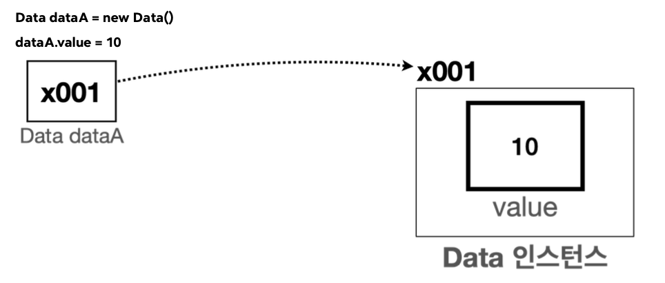
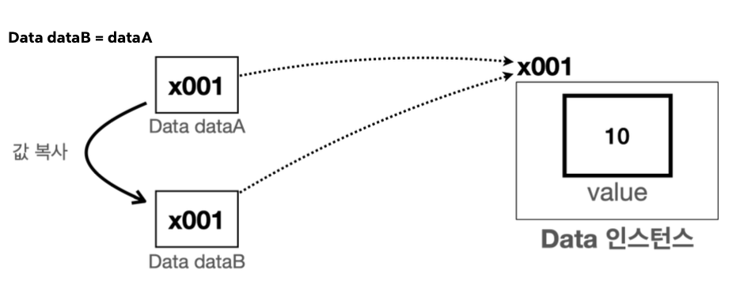
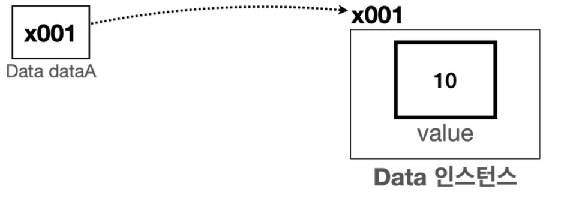
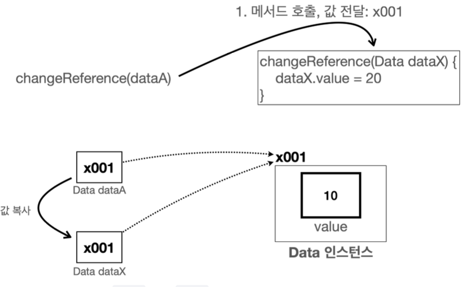
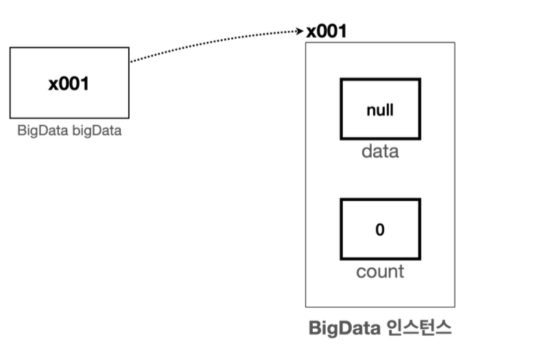
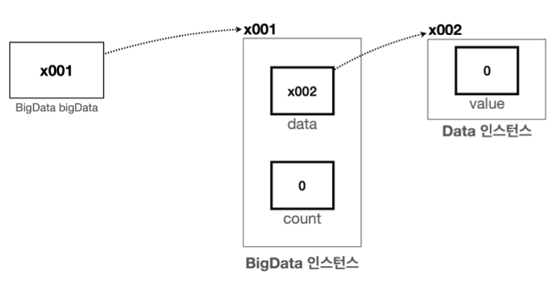

# 2. 기본형과 참조형

## 기본형 vs 참조형1 - 시작
**자바에서 참조형을 제대로 이해하는 것은 정말 중요하다고 강조한다.**
마치 C언어에서 포인터를 포기하듯이 자바에서는 참조형에서 많이 포기한다고 한다. 그만큼 제대로 알고 가야 뒤탈이 없다!

변수의 데이터 타입을 가장 크게 보면 기본형과 참조형으로 분류할 수 있다. 사용할 값을 직접 넣을 수 있는 기본형, 그리고 이전에 본 `Student student1`과 같이 객체가 저장된 메모리의 위치를 가리키는 참조값을 넣을 수 있는 참조형으로 분류할 수 있다.
- 기본형(Primitive Type): `int`, `long`, `double`, `boolean`처럼 변수에 사용할 값을 직접 넣을 수 있는 데이터 타입을 기본형이라 한다.
- 참조형(Reference Type): `Student student1`, `int[] students`와 같이 데이터에 접근하기 위한 참조(주소)를 저장하는 데이터 타입을 참조형이라 한다. 참조형은 객체 또는 배열에 사용된다. 

쉽게 이야기해서 기본형 변수에는 직접 사용할 수 있는 값이 들어 있지만 참조형 변수에는 위치(참조값)가 들어가 있다. 
참조형 변수를 통해서 뭔가 하려면 결국 참조값을 통해 해당 위치로 이동해야 한다.

**기본형 vs 참조형 - 기본**
- 기본형은 숫자 `10`, `20`과 같이 실제 사용하는 값을 변수에 담을 수 있다. 그래서 해당 값을 바로 사용 가능하다.
- 참조형은 실제 객체의 위치(참조, 주소)를 저장한다. 참조형에는 객체와 배열이 있다.
    - 객체는 `.`(dot)을 통해서 메모리 상에 생성된 객체를 찾아가야 사용할 수 있다. 
    - 배열은 `[]`를 통해서 메모리 상에 생성된 배열을 찾아가야 사용할 수 있다.

**기본형 vs 참조형 - 계산**
- 기본형은 값 그대로 계산이 가능하다.
- 참조형은 들어있는 참조값(주소값)가지고는 할 수 있는게 없다. 주소지에 가야 실체가 있다!
    - 객체 같은 경우 `.`으로 주소지에 간담에 가능하다.

**쉽게 이해하는 팁**
기본형을 제외한 나머지는 모두 참조형이다.
- 기본형은 소문자로 시작한다. `int`, `long`, `double`, `boolean` 모두 소문자로 시작
    - 기본형은 자바가 기본으로 제공하는 데이터 타입. 이러한 기본형은 개발자가 새로 정의할 수 없다. 개발자는 참조형인 클래스만 직접 정의할 수 있다.
- 클래스는 대문자로 시작한다. `Student`
    - 클래스는 모두 참조형이다.


**참고 - String**
자바에서 `String`은 특별하다 `String`은 사실 클래스이다. (C++에서도 그랬던 기억이 난다.) 그런데 기본형처럼 문자 값을 바로 대입할 수 있다. 문자는 매우 자주 다루기 때문에 자바에서 특별하게 편의 기능을 제공한다.

## 기본형 vs 참조형2 - 변수 대입

절대 까먹지 말아야할 대원칙! **자바는 항상 변수의 값을 복사해서 대입한다.**

### 참조형과 변수 대입
기본형의 변수 대입은 진짜 쉽다. 하지만 참조형과 변수 대입은 문제를 틀리고 나서 다시 정리를 한다.

참조형 예시를 위해 `Data`클래스를 하나 만들자. 이 클래스는 단순히 `int value`라는 멤버 변수를 하나 가진다.

**Data** 
```java
package ref;

public class Data {
    int value;
}
```

**VarChange2**
```java
package ref;

public class VarChange2 {
    public static void main(String[] args) {
        Data dataA = new Data();
        dataA.value = 10;
        Data dataB = dataA;
        
        System.out.println("dataA 참조값=" + dataA);
        System.out.println("dataB 참조값=" + dataB);
        System.out.println("dataA.value = " + dataA.value);
        System.out.println("dataB.value = " + dataB.value);
        
        //dataA 변경
        dataA.value = 20;
        System.out.println("변경 dataA.value = 20");
        System.out.println("dataA.value = " + dataA.value);
        System.out.println("dataB.value = " + dataB.value);
        
        //dataB 변경
        dataB.value = 30;
        System.out.println("변경 dataB.value = 30");
        System.out.println("dataA.value = " + dataA.value);
        System.out.println("dataB.value = " + dataB.value);
    }
}
```
나는 C언어 포인터! 이러면서 제대로 핵심을 파악하지 못했다. 
항상 포인터도 주소값을 가지기 때문에 `dataB`를 출력하면 `dataA`와 다른 주소값이 나오겠지 했는데 아니였다!



대원칙을 항상 생각해야 한다. `new Data()`를 해서 나온 참조값을 복사해서 대입해 `dataA`에 들어간다. 


그 다음 `dataB`에도 `dataA`에 들어있는 참조값을 복사해서 대입한다. 진짜 대원칙만 잘 숙지한다면 이게 끝이다.


## 기본형 vs 참조형3 - 메서드 호출
**대원칙: 자바는 항상 변수의 값을 복사해서 대입한다.** Don't forget to 대원칙

메서드 호출도 마찬가지이다. 메서드를 호출할 때 사용하는 매개변수(파라미터)도 결국 변수일 뿐이다! 따라서 메서드를 호출할 때 매개변수에 값을 전달하는 것도 앞서 설명한 내용과 같이 값을 복사해서 전달한다.

### 참조형과 메서드 호출

```java
package ref;

public class MethodChange2 {
    public static void main(String[] args) {
        Data dataA = new Data();
        dataA.value = 10;
        System.out.println("메서드 호출 전: dataA.value = " + dataA.value);
        changeReference(dataA);
        System.out.println("메서드 호출 후: dataA.value = " + dataA.value);
    }

    static void changeReference(Data dataX) {
        dataX.value = 20;
    }
}
```
이것을 보면 `Data`인스턴스를 생성하고, 참조값을 복사해서 `dataA`변수에 대입한다.


`changeReference` 메서드를 호출할때 `dataA`의 값을 매개변수(파라미터)인 `dataX`에 복사해서 대입한다!



그러니 참조값을 토대로 인스턴스에 접근해서 값을 바꾸기 때문에 메서드에 반환값이 없이 종료 되더라도 적용이 되어있다.

**기본형과 참조형의 메서드 호출**
자바에서 메서드의 매개변수(파라미터)는 항상 값에 의해 전달된다. 그러나 이 값이 실제 값이냐, 참조(메모리 주소)값이냐에 따라 동작이 달라진다.
- 기본형: 메서드로 기본형 데이터를 전달하면, 해당 값이 복사되어 전달된다. 이 경우, 메서드 내부에서 매개변수(파라미터)의 값을 변경해도, 호출자의 변수 값에는 영향이 없다.
- 참조형: 메서드로 참조형 데이터를 전달하면, 참조값이 복사되어 전달된다. 이 경우, 메서드 내부에서 매개변수(파라미터)로 전달될 객체의 멤버 변수를 변경하면, 호출자의 객체도 변경된다.

## 변수와  초기화

### 변수의 종류
- 멤버 변수(필드): 클래스에 선언
- 지역 변수: 메서드에 선언, 매개변수도 지역 변수의 한 종류이다.

### 변수의 값 초기화
- 멤버 변수: 자동 초기화
    - 인스턴스의 멤버 변수는 인스턴스를 생성할 때 자동으로 초기화
    - 숫자(`int`)=`0`, `boolean`=`false`, 참조형=`null`(`null`값은 참조할 대상이 없다는 뜻으로 사용된다.)
    - 개발자가 초기값을 직정 지정할 수 있다. 
- 지역 변수: 수동 초기화
    - 지역 변수는 항상 직접 초기화해야 한다.

## null
참조형 변수에는 항상 객체가 있는 위치를 가리키는 참조값이 들어간다.
참조형 변수에서 아직 가리키는 대상이 없다면 `null`이라는 특별한 값을 넣어둘 수 있다. 

나중에 아무도 참조하지 않는 인스턴스는 사용되지 않고 메모리 용량만 차지할 뿐이다.
C와 같은 과거 프로그래밍 언어는 개발자가 직접 사용해서 인스턴스를 메모리에서 제거해야 했다. 
자바는 이런 과정을 자동으로 처리해준다. 아무도 참조하지 않는 인스턴스가 있으면 JVM의 GC(가비지 컬렉션)가 더 이상 사용하지 않는 인스턴스라 판단하고 해당 인스턴스를 자동으로 메모리에서 제거해준다. (자바의 큰 장점)

객체는 해당 객체를 참조하는 곳이 있으면, JVM이 종료할 때 까지 계속 생존한다. 그런데 중간에 해당 객체를 참조하는 곳이 모두 사라지면 그때 JVM은 필요 없는 객체로 판단하고 GC(가비지 컬렉션)를 사용해서 제거한다.

## NullPointerException
객체를 참조할 때는 `.`(dot)을 사용한다. 이렇게 하면 참조값을 사용해서 해당 객체를 찾아갈 수 있다. 그런데 참조값이 `null`이라면 값이 없다는 뜻이므로, 찾아갈 수 있는 객체(인스턴스)가 없다. `NullPointerException`은 이처럼 `null`에 `.`(dot)을 찍었을 때 발생한다.

지역 변수의 경우에는 `null`문제를 파악하는 것이 어렵지 않다. 다음과 같이 멤버 변수가 `null`인 경우에는 주의가 필요하다.

```java
// Data Class
package ref;

public class Data {
    int value;
}
```

```java
// BigData Class
package ref;

public class BigData {
    Data data;
    int count;
}
```

```java
// NullMain3
package ref;

public class NullMain3 {
    public static void main(String[] args) {
        BigData bigData = new BigData();

        System.out.println("bigData.count=" + bigData.count);
        System.out.println("bigData.data=" + bigData.data);

        //NullPointException
        System.out.println("bigData.data.value:" + bigData.data.value);
    }
}
```
이렇게 하면 `BigData`의 인스턴스의 멤버변수는 초기화가 되어 `count = 0`, `data = null`이지만 `bigData.data.value`에 접근하려고 하면 참조 할 곳이 없으니까 `NullPointerException`이 발생한다.



이를 해결하려면 `Data` 인스턴스를 만드록 `BigData.data`멤버 변수에 참조값을 할당하면 된다. 

```java
// NullMain4
package ref;

public class NullMain4 {
    public static void main(String[] args) {
        BigData bigData = new BigData();
        Data data = new Data();
        bigData.data = data;

        System.out.println("bigData.count=" + bigData.count);
        System.out.println("bigData.data=" + bigData.data);

        //NullPointException
        System.out.println("bigData.data.value:" + bigData.data.value);
    }
}
```


### 정리
`NullPointerException`이 발생하면 `null`값에 `.`(dot)을 찍었다고 생각하면 문제를 쉽게 찾을 수 있다.

## 마무리 정리
### 대원칙: 자바는 항상 변수의 값을 복사해서 대입한다.
자바에서 변수에 값에 대입하는 것은 변수에 들어 있는 값을 복사해서 대입하는 것이다.
기본형, 참조형 모두 항상 변수에 있는 값을 복사해서 대입한다. 기본형이면 변수에 들어 있는 실제 사용하는 값을 복사해서 대입하고, 참조형이면 변수에 들어 있는 참조값을 복사해서 대입한다.
기본형이든 참조형이든 변수의 값을 대입하는 방식은 같다. 하지만 기본형과 참조형에 따라 동작하는 방식이 달라진다.

### 기본형 vs 참조형 - 기본
- 자바의 데이터 타입을 가장 크게 보면 기본형, 참조형 둘로 나눌 수 있다.
- 기본형을 제외한 나머지 변수는 모두 참조형이다. 클래스와 배열을 다루는 변수는, 참조형이다.
- 기본형 변수는 값을 직접 저장하지만, 참조형 변수는 참조(주소)를 저장한다.
- 기본형 변수는 산술 연산을 수행할 수 있지만, 참조형 변수는 산술 연산을 수행할 수 없다.
- 기본형 변수는 `null`을 할당할 수 없지만, 참조형 변수는 `null`을 할당할 수 있다.

### 기본형 vs 참조형 - 대입
- 기본형과 참조형 모두 대입시 변수 안에 있는 값을 읽고 복사해서 전달한다.
- 기본형은 사용하는 값을 복사해서 전달하고, 참조형은 참조값을 복사해서 전달한다! 이것이 중요!!. 실제 인스턴스가 복사되는 것이 아니다. 인스턴스를 가리키는 참조값을 복사해서 전달하는 것!! 따라서 하나의 인스턴스를 여러곳에서 참조할 수 있다.
- 헷갈리면 그냥 변수 안에 있는 들어간 값을 떠올려보자. 기본형은 사용하는 값이, 참조형은 참조값이 들어있다! 변수에 어떤 값이 들어있든간에 그 값을 그대로 복사해서 전달한다.

### 기본형 vs 참조형 - 메서드 호출 
- 메서드 호출시 기본형은 메서드 내부에서 매개변수(파라미터)의 값을 변경해도 호출자의 변수 값에는 영향이 없다.
- 메서드 호출시 참조형은 메서드 내부에서 매개변수(파라미터)로 전달된 객체의 멤버 변수를 변경하면, 호출자의 객체도 변경된다.
