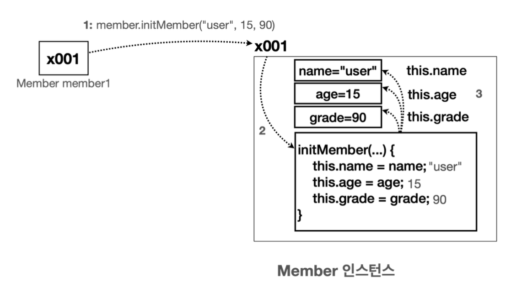

# 4. 생성자

## 생성자 - 필요한 이유
객체를 생성하자 마자 초기값을 설정해야 하는데 생성자가 없다면 초기설정을 직접 하거나 초기설정 메서드를 이용해야 하는데 그때마다 반복되는 요소가 많다. 더 나은 방법으로 생성자를 이용해 자기 자신의 데이터를 변경하는 기능을 이용한다.

### this
멤버 변수와 메서드의 매개변수의 이름이 같으면 둘을 어떻게 구분해야 할까?
- 이 경우 멤버 변수보다 매개변수가 코드 블럭의 더 안쪽에 있기 때문에 **매개변수가 우선순위**를 가진다. 따라서 `initMember(String name, ...)`  메서드 안에서 `name`이라고 적으면 매개변수에 접근하게 된다.
- 멤버 변수에 접근하려면 앞에 `this.`이라고 해주면 된다. 여기서 `this`는 인스턴스 자신의 참조값을 가리킨다.



**정리**
- 매개변수의 이름과 멤버 변수의 이름이 같은 경우 `this`를 사용해서 둘을 명확하게 구분해야 한다. 안그러면 둘다 매개변수를 뜻하게 된다. 결과적으로 멤버변수의 값이 변경되지 않는다.
- `this`는 인스턴스 자신을 가리킨다.
- `this`는 생략 가능하다. 이 경우 변수를 찾을 때 가까운 지역변수(매개변수도 지역변수다)를 먼저 찾고 없으면 그 다음으로 멤버 변수를 찾는다. 멤버 변수도 없으면 오류가 발생한다.
    ```java
    public class MemberThis {
        String nameField;
        
        void initMember(String nameParameter) {
            nameField = nameParameter;
        } 
    }
    ```
- 위에서 `this.nameField = nameParameter;` 를 붙이는 과거 코딩 스타일이 있었는데 영한샘은 굳이 선호하지 않는다고 한다. 관습이나 그런것에는 항상 `왜?`라는 의문이 필요하고 그 의문에 답을 하지 못한다면 좋은 관습이 아닐것이다.  
결론은 IDE가 발전하면서 멤버 변수와 지역 변수를 색상으로 구분해준다.


## 생성자 - 도입
프로그래밍을 하다보면 객체를 생성하고 바로 초기값을 할당해야 하는 경우가 많다. 그래서 대부분의 객체 지향 언어는 생성자라는 기능을 제공한다.

참고로 `new`키워드를 사용해서 객체를 생성할 때 마지막에 괄호`()`도 포함해야 하는 이유가 바로 생성자 때문이다. 객체를 생성하면서 동시에 생성자를 호출한다는 의미를 포함한다.

### 생성자의 장점
**중복 호출 제거**

객체를 생성하면서 동시에 생성 직후에 필요한 작업을 한번에 처리가능하다.

**제약 - 생성자 호출 필수**

생성자의 진짜 장점은 객체를 생성할 때 직접 정의한 생성자가 있다면 **직접 정의한 생성자를 반드시 호출**해야 한다는 점이다. 그러지 않다면 컴파일 오류가 발생한다.
생성자 덕분에 회원의 이름, 나이, 성적은 항상 필수로 입력하게 된다. 따라서 아무 정보 없는 유령 회원이 시스템 내부에 등장할 가능성을 원천 차단!

**생성자를 사용하면 필수값 입력을 보장할 수 있다** 
참고로 좋는 프로그램은 무한한 자유도가 주어지는 프로그램이 아니라 적절한 제약이 있는 프로그램이다.

## 기본 생성자
- 매개변수가 없는 생성자
- 클래스에 생성자가 하나도 없으면 자바 컴파일러는 매개변수가 없고, 작동하는 코드가 없는 기본 생성자를 자동으로 만들어준다.
- **생성자가 하나라도 있으면 자바는 기본 생성지를 만들지 않는다.**

**기본 생성자를 왜 자동으로 만들어줄까?**
만약 자바에서 기본 생성자를 만들어주지 않는다면 생성자 기능이 필요하지 않은 경우에도 모든 클래스에 개발자가 직접 기본 생성자를 정의해야 한다. 생성자 기능을 사용하지 않는 경우도 많기 때문에 이런 편의 기능을 제공한다.

**정리**
- 생성자는 반드시 호출되어야 한다.
- 생성자가 없으면 기본 생성자가 제공된다.
- **생성자가 하나라도 있으면 기본 생성자가 제공되지 않는다.** 이 경우 개발자가 정의한 생성자를 직접 호출해야 한다.

## 생성자 - 오버로딩과 this()
생성자도 메서드 오버로딩처럼 매개변수만 다르게 해서 여러 생성자를 제공할 수 있다.

### this()
`this()`라는 기능을 사용하면 생성자 내부에서 자신의 생성자를 호출할 수 있다. 참고로 `this`는 인스턴스 자신의 참조값을 가리킨다. 그래서 생성자를 호출한다고 생각하면 된다.

**기존 코드**
```java
public MemberConstruct(String name, int age) {
     this.name = name;
     this.age = age;
     this.grade = 50;
}

public MemberConstruct(String name, int age, int grade) {
     this.name = name;
     this.age = age;
     this.grade = grade;
}
```

**`this()` 적용 후 코드**
```java
public MemberConstruct(String name, int age) {
     this(name, age, 50) // 변경
}

public MemberConstruct(String name, int age, int grade) {
     this.name = name;
     this.age = age;
     this.grade = grade;
}
```
위에서 첫번째 생성자 내부에서 두번째 생성자를 호출한다.
`this()`를 사용하면 생성자 내부에서 다른 생성자를 호출할 수 있다. 이 부분을 잘 활용하면 지금과 같이 중복을 제거 할 수 있다. 물론 실행 결과는 기존과 같다.

**this() 규칙**
- `this()`는 생성자 코드의 첫줄에만 작성할 수 있다.

## 정리
생성자는 객체 직후 객체를 초기화 하기 위한 특별한 메서드로 생각할 수 있다.
