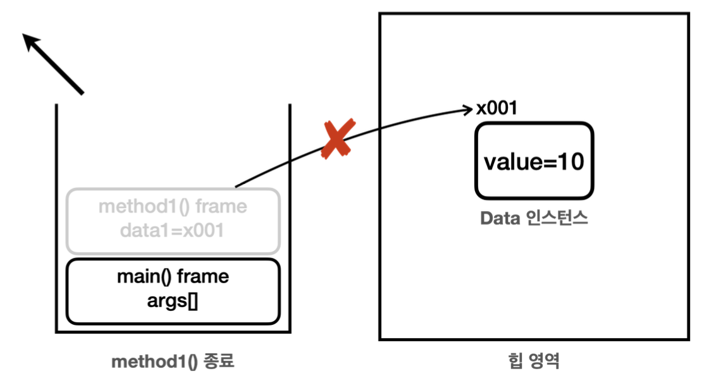

# 7.자바 메모리 구조와 static

## 자바 메모리 구조
### 자바 메모리 구조 - 비유

자바의 메모리 구조는 크게 메서드 영역, 스택 영역, 힙 영역 3개로 나눌 수 있다.
- **메서드 영역**: 클래스 정보를 보관한다. 이 클래스 정보가 붕어빵 틀이다.
- **스택 영역**: 실제 프로그램이 실행되는 영역이다. 메서드를 실행할 때 마다 하나씩 쌓인다.
- **힙 영역**: 객체(인스턴스)가 생성되는 영역이다. `new`명령어를 사용하면 이 영역을 사용한다. 쉽게 이야기해서 붕어빵 틀로부터 생성된 붕어빵이 존재하는 공간이다. 참고로 배열도 이 영역에 생성된다.

### 자바 메모리 구조 - 실제


- **메서드 영역(Method Area)**: 메서드 영역은 프로그램을 실행하는데 필요한 공통 데이터를 관리한다. 이 영역은 프로그램의 모든 영역에서 공유한다.
  - 클래스 정보: 클래스의 실행 코드(바이트 코드), 필드, 메서드와 생성자 코드등 모든 실행 코드가 존재한다.
  - static영역: `static`변수들을 보관한다. 뒤에서 자세히 설명
  - 런타임 상수 풀: 프로그램을 실행하는데 필요한 공통 리터럴 상수를 보관한다. 예를 들어서 프로그램에 `"hello"`라는 리터럴 문자가 있으면 이런 문자를 공통으로 묶어서 관리한다. 이 외에도 프로그램을 효율적으로 관리하기 위한 상수들을 관리한다. (참고로 문자열을 다루는 문자열 풀은 자바 7부터 힙 영역으로 이동했다.)
- **스택 영역(Stack Area)**: 자바 실행 시, 하나의 실행 스택이 생성된다. 각 스택 프레임은 지역 변수, 중간 연산 결과, 메서드 호출 정보 등을 포함한다. 
  - 스택 프레임: 스택 영역에 쌓이는 네모 박스가 하나의 스택 프레임이다. 메서드를 호출할 때 마다 하나의 스택 프레임이 쌓이고, 메서드가 종료되면 해당 스택 프레임이 제거된다.
- **힙 영역(Heap Area)**: 객체(인스턴스)와 배열이 생성되는 영역이다. 가비지 컬렉션(GC)이 이루어지는 주요 영역이며, 더 이상 참조되지 않는 객체는 GC에 의해 제거된다.

> 참고: 스택 영역은 더 정확히는 각 쓰레드별로 하나의 실행 스택이 생성된다. 따라서 쓰레드 수 만큼 스택 영역이 생성된다. 지금은 쓰레드를 1개만 사용하므로 스택 영역도 하나이다. 쓰레드에 대한 부분은 멀티 쓰레드를 학습해야 이해할 수 있다.

### 메서드 코드는 메서드 영역에

자바에서 특정 클래스로 100개의 인스턴스를 생성하면, 힙 메모리에 100개의 인스턴스가 생긴다. 각각의 인스턴스는 내부에 변수와 메서드를 가진다. 같은 클래스로 부터 생성된 객체라도, 인스턴스 내부의 변수 값은 서로 다를 수 있지만, 메서드는 공통된 코드를 공유한다. 따라서 객체가 생성될 때, 인스턴스 변수에는 메모리가 할당되지만, 메서드에 대한 새로운 메모리 할당은 없다. 메서드는 메서드 영역에서 공통으로 관리되고 실행한다.

정리하면 인스턴스의 메서드를 호출하면 실제로는 메서드 영역에 있는 코드를 불러서 수행한다.

## 스택과 큐 자료 구조

자바 메모리 구조 중 스택 영역에 대해 알아보기 전에 먼저 스택(Stack)이라는 자료 구조를 알아본다.

스택과 큐는 쉽다. 

스택은 후입 선출, 큐는 선입 선출이다.

**후입 선출(LIFO, Last In First Out)**
나중에 넣은 것이 가장 먼저 나오는 것

**선입 선출(FIFO, First In First Out)**
가장 먼저 넣은 것이 가장 먼저 나오는 것

프로그램 실행과 호출에는 **스택 구조**가 적합하다.

## 스택
**정리**
- 자바는 스택 영역을 사용해서 메서드 호출과 지역 변수(매개변수 포함)를 관리한다.
- 메서드를 계속 호출하면 스택 프레임이 계속 쌓인다.
- 지역 변수(매개변수 포함)는 스택 영역에서 관리한다.
- 스택 프레임이 종료되면 지역 변수도 함께 제거된다.
- 스택 프레임이 모두 제거되면 프로그램도 종료된다.

## 스택 영역과 힙 영역
스택에 메서드 호출이 있는데 그 안에서 힙 영역에 Data 인스턴스를 생성했다 가정하고 보자.





이렇게 그림을 보면 알 수 있듯이 `x001` 참조값을 가진 `Data` 인스턴스를 참조하는 곳이 더는 없으면 사용되는 곳도 없다. 

결과적으로 프로그램에서 더는 사용하지 않는 객체인 것이다. 이런 객체는 메모리만 차지하게 된다.

GC(가비지 컬렉션)은 이렇게 참조가 모두 사라진 인스턴스를 찾아서 메모리에서 제거한다.

**참고**: 힙 영역 외부가 아닌, 힙 영역 안에서만 인스턴스끼리 서로 참조하는 경우에도 GC의 대상이 된다. 

### 정리
지역 변수는 스택 영역에, 객체(인스턴스)는 힙 영역에 관리되는 것을 확인했다. 이제 나머지 하나가 남았다. 바로 메서드 영역이다. 메서드 영역이 관리하는 변수도 있다. 이것을 이해하기 위해서는 먼저 `static`키워드를 알아야 한다. `static` 키워드는 메서드 영역과 밀접한 연관이 있다.

## static 변수

`static`키워드는 주로 멤버 변수와 메서드에 사용된다.

`static`키워드를 사용하면 공용으로 함께 사용하는 변수를 만들 수 있다. (공용 변수)

**중간 정리**
`static`변수는 쉽게 이야기해서 클래스인 붕어빵 틀이 특별히 관리하는 변수이다. 붕어빵 틀은 1개이므로 클래스 변수도 하나만 존재한다. 반면에 인스턴스 변수는 붕어빵인 인스턴스의 수 만큼 존재한다.

### 용어 정리
```java
public class Data3 {
     public String name;
     public static int count; //static
}
```
예제 코드에서 `name` , `count` 는 둘다 멤버 변수이다.
멤버 변수(필드)는 `static` 이 붙은 것과 아닌 것에 따라 다음과 같이 분류할 수 있다.

**멤버 변수(필드)의 종류**
- **인스턴스 변수**: `static`이 붙지 않은 멤버 변수, 예)`name`
  - `static`이 붙지 않은 멤버 변수는 인스턴스를 생성해야 사용할 수 있고, 인스턴스에 소속되어 있다. 따라서 인스턴스 변수라 한다.
  - 인스턴스 변수는 인스턴스를 만들 때 마다 새로 만들어진다.
- **클래스 변수**: `static`이 붙은 멤버 변수, 예)`count`
  - 클래스 변수, 정적 변수, `static` 변수등으로 부른다. **용어를 모두 사용하니 주의하자**
  - `static`이 붙은 멤버 변수는 인스턴스와 무관하게 클래스에 바로 접근해서 사용할 수 있고, 클래스 자체에 소속되어 있다. 따라서 클래스 변수라 한다.
  - 클래스 변수는 자바 프로그램을 시작할 때 딱 1개가 만들어진다. 인스턴스와 다르게 보통 여러곳에서 공유하는 목적으로 사용된다.

### 변수와 생명주기
- **지역 변수(매개변수 포함)**: 지역 변수는 스택 영역에 있는 스택 프레임 안에 보관된다. 메서드가 종료되면 스택 프레임도 제거 되는데 이때 해당 프레임에 포함된 지역 변수도 함께 제거된다. 
- **인스턴스 변수**: 인스턴스에 있는 멤버 변수를 인스턴스 변수라 한다. 인스턴스 변수는 힙 영역을 사용한다. 힙 영역은 GC(가비지 컬렉션)가 발생하기 전까지는 생존하기 때문에 보통 지역 변수보다 생존 주기가 길다.
- **클래스 변수**: 클래스 변수는 메서드 영역의 static영역에 보관되는 변수이다. 메서드 영역은 프로그램 전체에서 사용하는 공용 공간이다. 클래스 변수는 해당 클래스가 JVM에 로딩 되는 순간 생성된다. 그리고 JVM이 종료될때 까지 생명주기가 이어진다. 따라서 가장 긴 생명주기를 가진다.

`static`이 정적이라는 이유는 바로 여기에 있다. 힙 영역에 생성되는 인스턴스 변수는 동적으로 생성되고, 제거된다. 반면에 `static`인 정적 변수는 거의 프로그램 실행 시점에 딱 만들어지고, 프로그램 종료 시점에 제거된다. 정적 변수는 이름 그래도 정적이다.

### 정적 변수 접근 법
`static` 변수는 클래스를 통해 바로 접근할 수도 있고, 인스턴스를 통해서도 접근할 수 있다.

## static 메서드

**클래스 메서드**
메서드 앞에도 `static`을 붙일 수 있다. 이것을 **정적 메서드** 또는 **클래스 메서드**라 한다. 정적 메서드라는 용어는 `static`이 정적이라는 뜻이기 때문이고, 클래스 메서드라는 용어는 인스턴스 생성 없이 마치 클래스에 있는 메서드를 바로 호출하는 것 처럼 느껴지지 때문이다.

**인스턴스 메서드**
`static`이 붙지 않은 메서드는 인스턴스를 생성해야 호출할 수 있다. 이것을 **인스턴스 메서드**라 한다.

### 정적 메서드 사용법
- `static`메서드는 `static`만 사용할 수 있다.
  - 클래스 내부의 기능을 사용할 때, 정적 메서드는 `static`이 붙은 **정적 메서드나 정적 변수만 사용할 수 있다.**
- 반대로 모든 곳에서 `static`을 호출할 수 있다.
  - 정적 메서드는 공용 기능이다. 따라서 접근 제어자만 허락한다면 클래스를 통해 모든 곳에서 `static`을 호출할 수 있다.

예제를 통해 정적 메서드의 사용법을 확인해보자.
```java
package static2;

public class DecoData {
    private int instanceValue;
    private static int staticValue;

    public static void staticCall() {
        // instanceValue++; //인스턴스 변수 접근, compile error
        // instanceMethod(); //인스턴스 변수 접근, compile error
        staticValue++;
        staticMethod();
    }

    public void instanceCall() {
        instanceValue++; // 인스턴스 변수 접근
        instanceMethod(); // 인스턴스 메서드 접근

        staticValue++; // 정적 변수 접근
        staticMethod(); // 정적 메서드 접근

    }

    private void instanceMethod() {
        System.out.println("instanceValue=" + instanceValue);
    }

    private static void staticMethod() {
        System.out.println("staticValue=" + staticValue);
    }

}
```
이번 예제에서는 접근 제어자를 적극 활용해서 필드를 포함한 외부에서 직접 필요하지 않은 기능은 모두 막아두었다. 

- `instanceValue`는 인스턴스 변수이다.
- `staticValue`는 정적 변수(클래스 변수)이다.
- `instanceMethod()`는 인스턴스 메서드이다.
- `staticMethod()`는 정적 메서드(클래스 메서드)이다.

`staticCall()`메서드를 보자.
이 메서드는 정적 메서드이다. 따라서 `static`만 사용할 수 있다. 정적 변수, 정적 메서드에는 접근할 수 있지만, `static`이 없는 인스턴스 변수나 인스턴스 메서드에 접근하면 **컴파일 오류가 발생**한다.
코드를 보면 `staticCall()` -> `staticMethod()`로 `static`에서 `static`을 호출하는 것을 확인할 수 있다.

`instanceCall()`메서드를 보자.
이 메서드는 인스턴스 메서드이다. 모든 곳에서 공용인 `static`을 호출할 수 있다. 따라서 정적 변수, 정적 메서드에 접근할 수 있다. 물론 인스턴스 변수, 인스턴스 메서드에도 접근할 수 있다. (접근제어자만 맞다면 다 접근이 가능)

**정적 메서드가 인스턴스의 기능을 사용할 수 없는 이유**

정적 메서드는 클래스의 이름을 통해 바로 호출 가능. 그래서 인스턴스처럼 참조값의 개념이 없다.
특정 인스턴스의 기능을 사용하려면 참조값을 알아야 하는데, 정적 메서드는 참조값이 없이 호출한다. 따라서 정적 메서드 내부에서 인스턴스 변수나 인스턴스 메서드를 사용할 수 없다.

물론 당연한 이야기지만 객체의 참조값을 직접 매개변수로 전달하면 정적 메서드도 인스턴스의 변수나 메서드를 호출할 수 있다.

### 용어 정리
**멤버 메서드의 종류**

- **인스턴스 메서드**: `static`이 붙지 않은 멤버 메서드
- **클래스 메서드**: `static`이 붙은 멤버 메서드
  - 클래스 메섣, 정적 메서드, `static` 메서드등으로 부른다. 

`static`이 붙지 않은 멤버 메서드는 인스턴스 생성해야 사용가능, 인스턴스에 소속되어 있으므로 따라서 인스턴스 메서드

`static`이 붙은 멤버 메서드는 인스턴스 무관 클래스에 바로 접근 사용 가능, 클래스 자체에 소속, 따라서 클래스 메서드라 한다.

참고로 멤버 변수에도 똑같이 적용됨.

**정적 메서드 활용**

정적 메서드는 객체 생성이 필요 없이 메서드의 호출만으로 필요한 기능을 수행할 때 주로 사용한다.
예를 들어 간단한 메서드 하나로 끝나는 유틸리티성 메서드에 자주 사용한다. 수학의 여러가지 기능을 담은 클래스를 만들 수 있는데, 이 경우 인스턴스 변수 없이 입력한 값을 계산하고 반환하는 것이 대부분. 이럴 대 정적 메서드를 사용해서 유틸리티성 메서드를 만들면 좋다.

### 정적 메서드 접근 법

인스턴스를 통한 접근, 클래스를 통해 바로 접근이 가능하다.

**인스턴스를 통한 접근 `data.staticCall()`**

정적 메서드의 경우 인스턴스를 통한 접근은 추천하지 않음. 왜냐하면 코드를 읽을 때 마치 인스턴스 메서드에 접근하는 것 처럼 오해할 수 있기 때문이다.

**클래스를 통한 접근 DecoData.staticCall()**

정적 메서드는 클래스에서 공용으로 관리하기 때문에 클래스를 통해서 접근하는 것이 더 명확하다. 따라서 정적 메서드에 접근할 때는 클래스를 통해서 접근하자.

### static import
정적 메서드를 사용할 때 해당 메서드를 다음과 같이 자주 호출해야 한다면 `static import`기능을 고려하자.

클래스명 생략하고 메서드 호출 가능


### main() 메서드는 정적 메서드
인스턴스 생성 없이 실행하는 가장 대표적인 메서드가 바로 `main()`메서드
`main()` 메서드는 프로그램을 시작하는 시작점이 되는데, 생각해보면 객체를 생성하지 않아도 `main()` 메서드가 작 동했다. 이것은 `main()` 메서드가 `static` 이기 때문이다.

정적 메서드는 정적 메서드만 호출할 수 있다. 
`main()`메서드에서도 호출하는 메서드는 정적 메서드

## 문제풀이 배운점 

다 비슷비슷 복습하는 느낌이였는데 
한 클래스의 객체를 생성하지 않고 유틸리성으로 쓰고 싶다. 생성자를 private로 해두면 된다.


