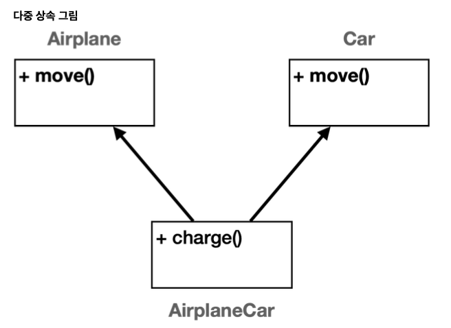
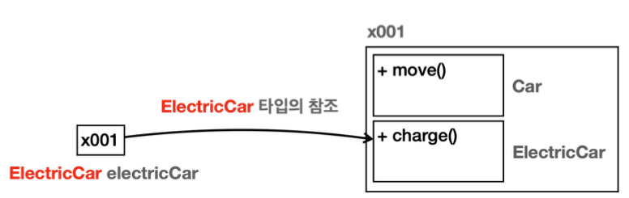
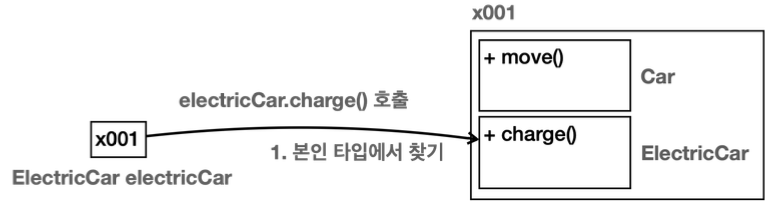
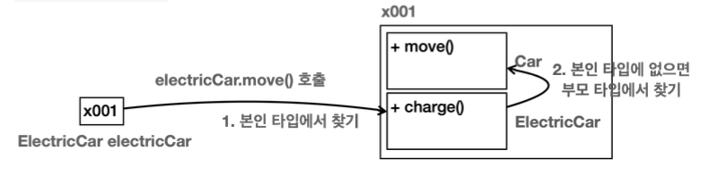
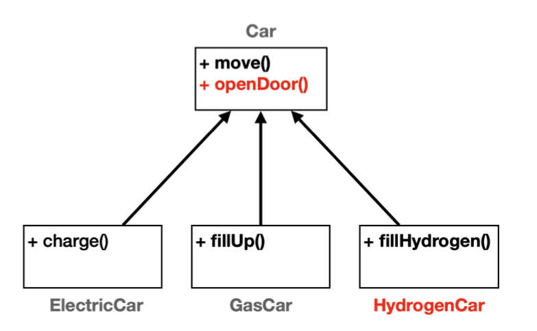
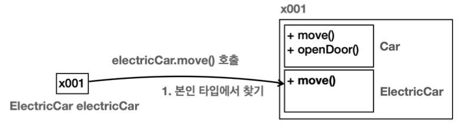
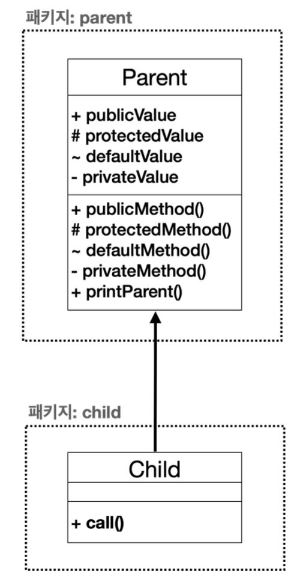
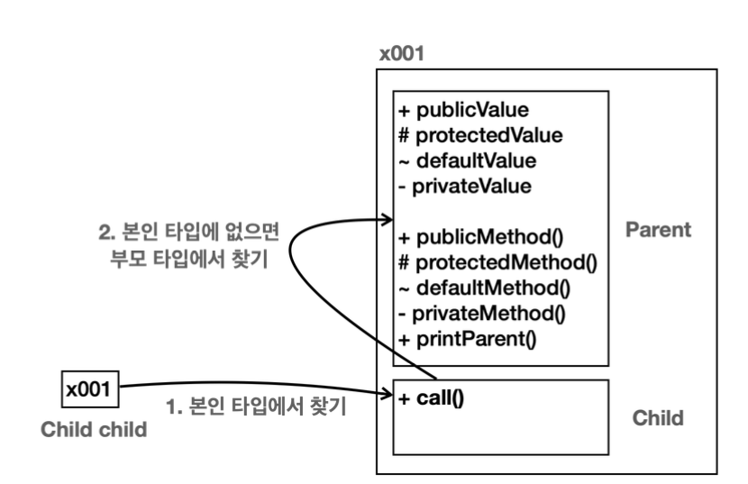
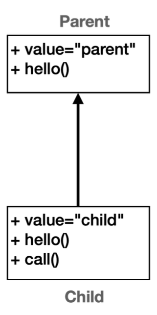
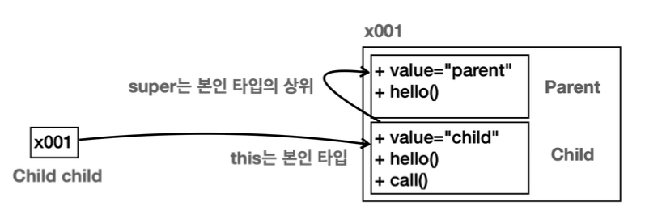

# 9. 상속

## 상속 - 시작

전기차와 가솔린차가 있다. 이둘은 공통의 자동차라는 개념이 있다. 
전기차와 가솔린차는 자동차의 좀 더 구체적인 개념이다. 
반대로 자동차는 전기차와 가솔린차를 포함하는 추상적인 개념이다. 그래서인지 잘 보면 둘의 공통 기능이 보인다. 
이동같은게 예시이다.

**전기차든 가솔린차든 주유하는 방식이 다른 것이지 이동하는 것은 똑같다. 이런 경우 상속 관계를 사용하는 것이 효과적이다.**


## 상속 관계

상속은 객체 지향 프로그래밍의 핵심 요소 중 하나로, 기존 클래스의 필드와 메서드를 새로운 클래스에서 재사용하게 해준다. 이름 그래도 기존 클래스의 속성과 기능을 그대로 물려받는 것이다. 상속을 사용하려면 `extends`키워드를 사용하면 된다. 그리고 `extends` **대상은 하나만 선택**할 수 있다.

**용어 정리**
- **부모 클래스(슈퍼 클래스)**: 상속을 통해 자신의 필드와 메서드를 다른 클래스에 제공하는 클래스
- **자식 클래스(서브 클래스)**: 부모 클래스로부터 필드와 메서드를 상속받는 클래스


### 단일 상속
참고로 자바는 다중 상속을 지원하지 않는다. 그래서 `extend`대상은 하나만 선택할 수 있다. 부모를 하나만 선택할 수 있다는 뜻이다. 물론 부모가 또 다른 부모를 하나 가지는 것은 괜찮다. 

만약 비행기와 자동차를 상속 받아서 하늘을 나는 자동차를 만든다고 가정해보자. 만약 그림과 같이 다중 상속을 사용하게 되면 `AirplaneCar`입장에서 `move()`를 호출할 때 어떤 부모의 `move()`를 사용해야 할지 애매한 문제가 발생한다. 이것을 다이아몬드 문제라 한다. 그리고 다중 상속을 사용하면 클래스 계층 구조가 매우 복잡해질 수 있다. 이런 문제점 때문에 자바는 클래스의 다중 상속을 허용하지 않는다. 대신에 이후에 설명한 인터페이스의 다중 구현을 허용해서 이러한 문제를 피한다.

## 상속과 메모리 구조
**이 부분을 제대로 이해하는 것이 앞으로 정말 중요하다!**
상속 관계를 객체로 생성할 때 메모리 구조를 확인해보자.

```java
ElectricCar electricCar = new ElectricCar();
```

`new ElectricCar()`를 호출하면 `ElectricCar`뿐만 아니라 상속 관계에 있는 `Car`까지 함께 포함해서 인스턴스를 생성한다. 참조값은 `x001`로 하나이지만 실제로 그 안에서는 `Car`, `ElectricCar`라는 두가지 클래스 정보가 공존하는 것이다.
상속이라고 해서 단순하게 부모의 필드와 메서드만 물려 받는게 아니다. 상속 관계를 사용하면 부모 클래스도 함께 포함해서 생성된다. 외부에서 볼때는 하나의 인스턴스를 생성하는 것 같지만 내부에서는 부모와 자식이 모두 생성되고 공간도 구분된다. 

`electricCar.charge()`**호출**


내부에 부모와 자식이 모두 존재한다. 호출 했을때 어디를 통해 찾을지 모른다. 
이때는 **호출하는 변수의 타입(클래스)을 기준으로 선택**한다.
`electricCar`변수의 타입이 `ElectricCar`이므로 인스턴스 내부에 같은 타입인 `ElectricCar`를 통해서 `charge()`를 호출한다.

`electricCar.move()`**호출**


상속 관계에서는 자식 타입에 해당 기능이 없으면 부모 타입으로 올라가서 찾는다. 

만약 부모에서도 해당 기능을 찾지 못하면 더 상위 부모에서 필요한 기능을 찾아본다. 부모에 부모로 계속 올라가면서 필드나 메서드를 찾는 것이다. 물론 계속 찾아도 없으면 컴파일 오류가 발생한다.

**상속과 메모리 구조는 반드시 이해!!**
- 상속 관계의 객체를 생성하면 그 내부에는 부모와 자식이 모두 생성된다.
- 상속 관계의 객체를 호출할 때, 대상 타입을 정해야 한다. 이때 호출자의 타입을 통해 대상 타입을 찾는다.
- 현재 타입에서 기능을 찾지 못하면 상위 부모 타입으로 기능을 찾아서 실행한다. 기능을 찾지 못하면 컴파일 오류가 발생한다.


## 상속과 기능 추가

- 모든 차량에 문열기 기능 추가
- 새로운 수소차를 추가



상속이 없었다면 중복되는 코드도 많고 일일이 많은 것을 수정해줘야 한다.

하지만 상속 관계 덕분에 중복은 줄어들고, 새로운 수소차를 편리하게 확장(extend)할 수 있다.


## 상속과 메서드 오버라이딩
부모에게서 상속 받은 기능을 자식이 **재정의 하는 것을 메서드 오버라이딩(Overriding)** 이라 한다.

### @Override
`@`이 붙은 부분을 애노테이션이라 한다. 애노테이션은 주석과 비슷한데, 프로그램이 읽을 수 있는 특별한 주석이라 생각하면 된다. 

### 오버라이딩과 메모리 구조
ElectricCar에서 move 오버라이딩 했다고 가정하자.



1. `electricCar.move()`를 호출한다.
2. 호출한 `electricCar`의 타입은 `ElectricCar`이다. 따라서 인스턴스 내부의 `ElectricCar`타입에서 시작한다.
3. `ElectricCar`타입에 `move()`메서드가 있다. 해당 메서드를 실행한다. 이때 실행할 메서드를 이미 찾았으므로 부모 타입을 찾지 않는다.

**오버로딩(Overloading)과 오버라이딩(Overriding)**
- **메서드 오버로딩**: 메서드 이름이 같고 매개변수(파라미터)가 다른 메서드를 여러개 정의하는 것을 메서드 오버로딩(Overloading)이라 한다. 오버로딩은 번역하면 과적인데, 과하게 물건을 담았다는 뜻이다. 따라서 같은 이름의 메서드를 여러개 정의했다고 이해하면 된다.
- **메서드 오버라이딩**: 메서드 오버라이딩은 하위 클래스에서 상위 클래스의 메서드를 재정의하는 과정을 의미한다.
따라서 상속 관계에서 사용한다. 부모의 기능을 자식이 다시 정의하는 것이다. 오버라이딩을 단순히 해석하면 무언가를 넘어서 타는 것을 말한다. 자식의 새로운 기능이 부모의 기존 기능을 넘어 타서 기존 기능을 새로운 기능으로 덮어버린다고 이해하면 된다. 오버라이딩을 우리말로 번역하면 무언가를 다시 정의한다고 해서 **재정의**라 한다. 상속 관계에서는 기존 기능을 다시 정의한다고 이해하면 된다. 실무에서는 메서드 오버라이딩, 메서드 재정의 둘 다 사용한다.

#### 메서드 오버라이딩 조건
**부모 메서드와 같은 메서드를 오버라이딩 할 수 있다 정도로 이해하면 충분**

- **메서드 이름**: 같아야 한다.
- **메서드 매개변수(파라미터)**: 매개변수(파라미터) 타입, 순서, 개수가 같아야 한다.
- **반환 타입**: 같아야 한다. 단 반환 타입이 하위 클래스 타입일 수 있다.
- **접근 제어자**: 오버라이딩 메서드의 접근 제어자는 상위 클래스의 메서드보다 더 제한적이어서는 안된다.
예를들어 상위 `protected`이면 하위는 `public`, `protected`로 오버라이드 가능하지만, `private`, `default`로 오버라이드 할 수 없다.
- **예외**: 상위모다 더 많은 체크 예외를 `throws`로 선언할 수 없다. 
- `static`, `final`, `private`: 키워드가 붙은 메서드는 오버라이딩 될 수 없다.
    - `static`은 클래스 레벨에서 작동하므로 인스턴스 레벨에서 사용하는 오버라이딩이 의미가 없다. 쉽게 이야기 해서 그냥 클래스 이름을 통해 필요한 곳에 직접 접근하면 된다.
    - `final` 메서드는 재정의를 금지한다.
    - `private`메서드는 해당 클래스에서만 접근 가능하기 때문에 하위 클래스에서 보이지 않아 불가능.
- **생성자 오버라이딩**: 생성자는 오버라이딩 할 수 없다.

## 상속과 접근 제어

**접근 제어와 메모리 구조**


본인 타입에 없으면 부모 타입에서 기능을 찾는데, 이때 접근 제어자가 영향을 준다. 왜냐하면 객체 내부에서는 자식과 부모가 구분되어 있기 때문이다. 결국 자식 타입에서 부모 타입의 기능을 호출할 때, 부모 입장에서 보면 외부에서 호출한 것과 같다.

### super - 부모 참조
부모와 자식의 필드명이 같거나 오버라이딩 되어 있으면, 자식에서 부모의 필드나 메서드를 호출할 수 없다.
이때 `super`키워드를 사용하면 부모를 참조할 수 있다. `super`는 이름 그대로 부모 클래스에 대한 참조를 나타낸다.

다음 예를 보자. 부모의 필드명과 자식의 필드명이 둘다 `value`로 똑같다. 메서드도 `hello()`로 자식에서 오버라이딩 되어 있다. 이때 자식 클래스에서 부모 클래스의 `value`와 `hello()`를 호출하고 싶다면 `super`키워드를 사용하면 된다.



```java
package extends1.super1;

public class Parent {
    public String value = "parent";

    public void hello() {
        System.out.println("Parent.hello");
    }
}
```

```java
package extends1.super1;

public class Child extends Parent {
    public String value = "child";

    @Override
    public void hello() {
        System.out.println("Child.hello");
    }

    public void call() {
        System.out.println("this value = " + this.value);
        System.out.println("super value = " + super.value);

        this.hello();
        super.hello();
    }
}
```

`call()`메서드를 보자.
- `this`는 자기 자신의 참조를 뜻한다. `this`는 생략할 수 있다.
- `super`는 부모 클래스에 대한 참조를 뜻한다.
- 필드 이름과 메서드 이름이 같지만 `super`를 사용해서 부모 클래스에 있는 기능을 사용할 수 있다.

```java
package extends1.super1;

public class Super1Main {
    public static void main(String[] args) {
        Child child = new Child();
        child.call();
    }
}
```

실행결과
```
this value = child
super value = parent
Child.hello
Parent.hello
```
실행 결과를 보면 `super`를 사용한 경우 부모 클래스의 기능을 사용한 것을 확인할 수 있다.

**super 메모리 그림**



### super - 생성자
상속 관계의 인스턴스를 생성하면 결국 메모리 내부에는 자식과 부모 클래스가 각각 다 만들어진다. `Child`를 만들면 부모인 `Parent`까지 함께 만들어지는 것이다. 따라서 각각의 생성자도 모두 호출되어야 한다. 

**상속 관계를 사용하면 자식 클래스의 생성자에서 부모 클래스의 생성자를 반드시 호출해야 한다. (규칙)**
상속 관계에서 부모의 생성자를 호출할 때는 `super(...)`를 사용하면 된다.

부모클래스의 생성자가 기본 생성자(파라미터가 없는 생성자)인 경우에는 `super()`를 생략할 수 잇다.
- 상속 관계에서 첫줄에 `super(...)`를 생략하면 자바는 부모의 기본 생성자를 호출하는 `super()`를 자동으로 만들어준다.
- 참고로 기본 생성자를 많이 사용하기 때문에 편의상 이런 기능을 제공한다.
- 부모의 기본 생성자가 없다면 자식 클래스의 생성자에서 부모의 기본 생성자를 호출하는 `super()`를 사용하거나 생략할 수 없다.


