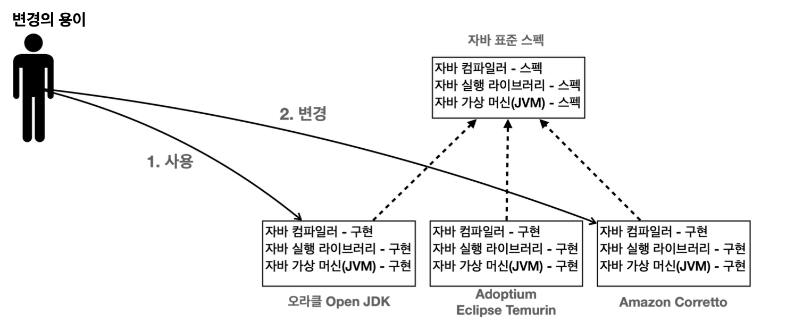

# 1. Hello World

# IntelliJ
- 인텔리제이에서 한글보다는 영어로 하는게 좋다.
    - 개발하면서 필요한 기능들을 검색하게 되는데, 영문으로된 자료가 많다.
- 다운로드 소스 코드 실행 방법
    - `File -> New -> Project from Existing Sources...` 선택
    - 압축을 푼 프로젝트 폴더 선택
    - `Create project from existing sources` 선택
    - 이후계속 `Next` 선택
    - openjdk-21 선택 (맞춰서 선택)
    - 만약 JDK가 없다면 왼쪽 상단의 + 버튼을 눌러서 openjdk 21 다운로드 후 선택
    - 이후 `Create` 버튼선택

# 주석

자바에서는 한줄 주석은 `//`, 여러줄 주석은 `/*` `*/`

# 자바란?

## 자바 표준 스펙

### 자바 표준 스펙과 구현

자바는 `표준 스펙`과 `구현`으로 나눌 수 있다.

- 표준 스펙
    - 자바는 이렇게 만들어야 한다는 설계도이며, 문서이다.
    - 이 표준 스펙을 기반으로 여러 회사에서 실제 작동하는 자바를 만든다.
    - 자바 표준 스펙은 자바 커뮤니티 프로세스(JCP)를 통해 관리된다.
- 다양한 자바 구현
    - 여러 회사에서 자바 표준 스펙에 맞추어 실제 작동하는 자바 프로그램을 개발한다.
    - 각각 장단점이 존재함. 예를 들어 Amazon Corretto는 AWS에 최적화 되어 있다.
    - 각 회사들은 대부분 윈도우, MAC, 리눅스 같이 다양한 OS에서 작동하는 버전의 자바도 함께 제공한다.

## 변경의 용이

- 자바 구현들은 모두 표준 스펙에 맞도록 개발되어 있다. 따라서 오라클 Open JDK를 사용하다가 Amazon Corretto 자바로 변경해도 대부분 문제 없이 동작한다.

참고: 학습 단계에서는 어떤 자바를 사용하든 크게 상관이 없다.

## 컴파일과 실행

자바 프로그램은 컴파일과 실행 단계를 거친다.

프로세스는 다음과 같다.

- `Hello.java`와 같은 자바 소스 코드를 개발자가 작성
- 자바 컴파일러를 사용해서 소스 코드를 컴파일 한다.
    - 자바가 제공하는 `javac`라는 프로그램을 사용
    - `.java` → `.class` 파일이 생성
    - 자바 소스 코드를 바이트코드로 변환하며 자바 가상 머신에서 더 빠르게 실행될 수 있게 최적화하고 문법 오류도 검출
- 자바 프로그램을 실행
    - 자바가 제공하는 `java`라는 프로그램을 사용
    - 자바 가상 머신(JVM)이 실행되면서 프로그램이 작동

## IDE와 자바

### 인텔리제이를 통한 자바 설치 관리

- 인텔리제이는 내부에 자바를 편리하게 설치하고 관리할 수 있는 기능을 제공
- 이 기능을 사용하면 인텔리제이를 통해 자바를 편리하게 다운로드 받고 실행할 수 있다.

### 인텔리제이를 통한 자바 컴파일, 실행 과정

- 컴파일
    - 자바 코드를 컴파일 하려면 `javac`라는 프로그램을 직접 사용해야 하는데, 인텔리제이는 자바 코드를 실행 할 때 이 과정을 자동으로 처리해준다.
        - 예) `javac Hello.java`
    - 인텔리제이 화면에서 프로젝트에 있는 `out` 폴더에 가보면 컴파일된 `.class` 파일이 있는 것을 확인가능하다.
- 실행
    - 자바를 실행하려면 `java` 라는 프로그램을 사용해야 한다. 이때 컴파일된 `.class` 파일을 지정해주면 된다.
    - 예) `java Hello`, 참고로 확장자는 제외됨
- 인텔리제이 짱, 자바코드를 실행하면 컴파일과 실행을 모두 한번에 처리해준다.
- 덕분에 편하게 개발하고 학습이 가능하다.

## 자바와 운영체제 독립성

### 일반적인 프로그램

- 일반적인 프로그램은 다른 운영체제에서 실행할 수 없다.
- 예를 들어서 윈도우 프로그램은 MAC이나 리눅스에서 작동하지 않는다.
- 왜냐하면 윈도우 프로그램은 윈도우 OS가 사용하는 명령어들로 구성되어 있기 때문이다. 해당 명령어는 다른 OS와는 호환되지 않는다.

### 자바 프로그램

- 자바 프로그램은 자바가 설치된 모든 OS에서 실행할 수 있다.
- 자바 개발자는 특정 OS에 맞추어 개발하지 않아도 된다. 자바 개발자는 자바에 맞추어 개발하면 된다. OS 호환성 문제는 자바가 해결한다. `Hello.class` 와 같이 컴파일된 자바 파일은 모든 자바 환경에서 실행할 수 있다.
- 윈도우 자바는 윈도우 OS가 사용하는 명령어들로 구성되어 있다. MAC이나 리눅스 자바도 본인의 OS가 사용하는 명령어들로 구성되어 있다. 개발자는 각 OS에 맞도록 자바를 설치하기만 하면 된다.

### 자바 개발과 운영 환경

- 개발할 때 자바와 서버에서 실행할 때 다른 자바 사용가능
- 개발자는 편의를 위해 보통 MAC, 윈도 OS에서 개발
- 서버는 주로 리눅스를 사용
- 자바의 운영체제 독립성 덕분에 각각의 환경에 맞추어 자바를 설치하는 것이 가능하다.
