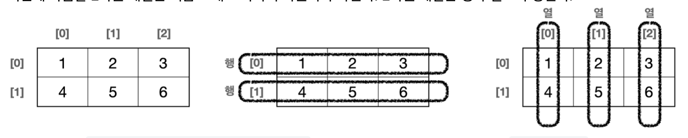

# 8. 배열

### 배열과 초기화

- 자바는 배열을 생성할 때 그 내부값을 자동으로 초기화한다.

# 기본형 vs 참조형

자바의 변수 데이터 타입을 가장 크게 보면 기본형과 참조형으로 분류할 수 있다. 사용하는 값을 직접 넣을 수 있는 기본형, 그리고 방금 본 배열 변수와 같이 메모리의 참조값을 넣을수 있는 참조형으로 분류할 수 있다.

- 기본형(Primitive Type): 우리가 지금까지 봤던 `int`, `long`, `double`, `boolean` 처럼 변수에 사용할 값을 직접 넣을 수 있는 데이터 타입을 기본형이라 한다.
- 참조형(Reference Type): `int[] students` 와 같이 데이터에 접근하기 위한 참조(주소)를 저장하는 데이터 타입을 참조형(Reference Type)이라 한다. 뒤에서 학습하는 객체나 클래스를 담을 수 있는 변수들도 모두 참조형이다.

### 참고

배열은 왜 이렇게 복잡하게 참조형을 사용할까? 지금까지 배운 변수처럼 단순히 그 안에 값을 넣고 사용하면 되는 것 아닐까?

- 기본형은 선언과 동시에 크기가 정해진다. 따라서 크기를 동적으로 바꾸거나 할 수는 없다. 반면에 앞서본 배열과 같은 참조형은 크기를 동적으로 할당할 수 있다. 예를 들어 `Scanner`를 사용해서 사용자 입력에 따라 `size`변수의 값이 변하고, 생성되는 배열의 크기도 달라질 수 있다. 이런 것을 동적 메모리 할당이라 한다. 기본형은 선언과 동시에 사이즈가 정적으로 정해지지만, 참조형을 사용하면 이처럼 동적으로 크기가 변해서 유연성을 제공할 수 있다.
- 기본형은 사용할 값을 직접 저장한다. 반면에 참조형은 메모리에 저장된 배열이나 객체의 참조를 저장한다. 이로 인해 참조형은 더 복잡한 데이터 구조를 만들고 관리할 수 있다. 반면 기본형은 더 빠르고 메모리를 효율적으로 처리한다.

# 배열 리팩토링

### 리팩토링

리팩토링은 기존의 코드 기능은 유지하면서 내부 구조를 개선하여 가독성을 높이고, 유지보수를 용이하게 하는 과정을 뜻한다. 이는 중복을 제거하고, 복잡성을 줄이며, 이해하기 쉬운 코드로 만들기 위해 수행된다. 리팩토링은 버그를 줄이고, 프로그램의 성능을 향상시킬 수도 있으며, 코드의 설계를 개선하는 데에도 도움이 된다.

쉽게 이야기해서 작동하는 기능은 똑같은데, 코드를 개선하는 것을 리팩토링이라 한다.

### 초기화

배열은 `{}`를 사용해서 생성과 동시에 편리하게 초기화 하는 기능을 제공한다.

```java
int[] students;
students = new int[]{90, 80, 70, 60, 50}; //배열 생성과 초기화

// 한줄도 가능
int[] students = new int[]{90, 80, 70, 60, 50}; //배열 변수 선언, 배열 생성과 초기화
```

### 간단한 배열 생성

배열은 `{}`만 사용해서 생성과 동시에 편리하게 초기화 하는 기능을 제공한다.

**배열의 편리한 초기화**

```java
int[] students = {90, 80, 70, 60, 50};
```

단 이때는 예제와 같이 배열 변수의 선언을 한 줄에 함께 사용할 때만 가능하다.

# 2차원 배열

2차원 배열은 `int[][] arr = new int[2][3]` 와 같이 선언하고 생성

`arr[행][열]`, `arr[row][column]`

### 초기화

방법 1

근데 행열이 잘 안느껴진다.
`{{1, 2, 3},{4, 5, 6}}`

방법 2

라인을 적절하게 넘겨줘 명확하게 해준다. 코드를 더 쉽게 이해할 수 있다.

```
{
   {1, 2, 3},
   {4, 5, 6}
}
```

# 향상된 for문

향상된 for문(Enhanced For Loop)이 있다. 향상된 for문을 이해하려면 배열을 먼저 알아야 한다. 각각의 요소를 탐색한다는 의미로 for-each문이라고도 많이 부른다.

향상된 for문 정의

```java
for (변수 : 배열 또는 컬렉션) {
	// 배열 또는 컬렉션 요소를 순회하면서 수행할 작업
}

// 예시
//향상된 for문, for-each문
for (int number : numbers) {
    System.out.println(number);
}
```

실무에서 많이 사용한다!